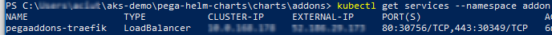
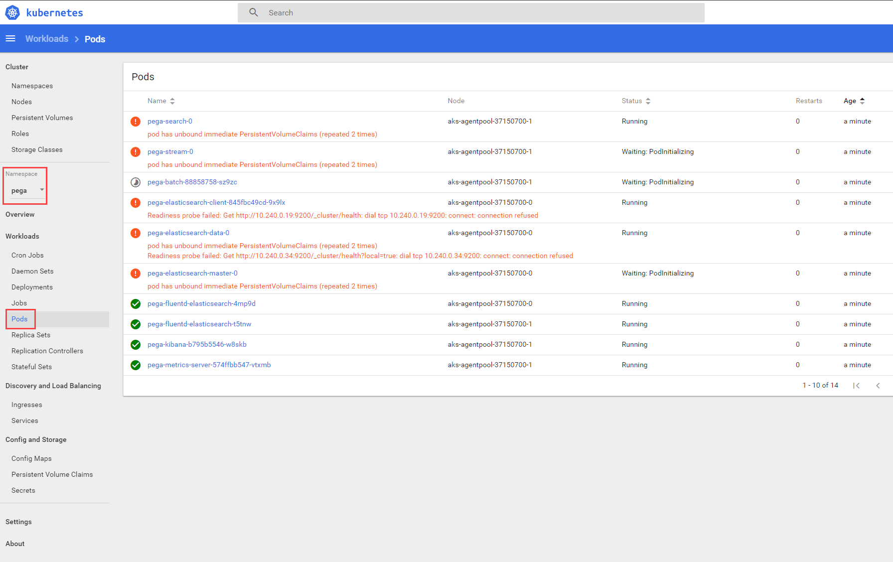

Deploying Pega Platform on AKS
===============================

About this document
-------------------

Use this set of procedures to deploy Pega Platform™ on an Azure Kubernetes
Service (AKS) cluster set up in your Microsoft Azure account. It is designed for
any level of user, from a System Administrator to a development engineer who's
interested in learning how to install and deploy Pega Platform onto AKS.

Pega helps enterprises and agencies quickly build business apps that deliver the
outcomes and end-to-end customer experiences they need. Using the procedures in
this guide, a user will be able to install and deploy Pega software onto AKS
without much experience in either AKS configurations or Pega Platform
deployments.

How the deployment works
------------------------

Pega provides customized orchestration tools and docker images required to
orchestrate a deployment in an AKS cluster you create for the deployment using
the following stepped tasks:

1. [Prepare your local system – 45 minutes](#prepare-your-local-system--45-minutes) – install required applications and configuration files.

2. [Prepare your Pega Platform installation Docker image – 15 minutes](#prepare-your-pega-platform-installation-docker-image--15-minutes) – download Pega Platform 8.3.1 or later and build a docker image used to install Pega Platform into your SQL database.

3. [Prepare your AKS resources – 45 minutes](#prepare-your-aks-resources--45-minutes) – create an AKS cluster, an SQL database, and a storage resource in your Azure account.

4. [Deploying Pega Platform using Helm charts – 30 minutes](#installing-and-deploying-pega-platform-using-helm-charts--90-minutes) – customize a configuration file with your AKS details and use kubectl and helm to install and then deploy Pega Platform onto your AKS cluster.

5. [Logging into Pega Platform – 10 minutes](#logging-into-pega-platform--10-minutes) – configure your network connections in your DNS zone so you can log onto Pega Platform.

You can review the Pega architecture overview to understand how Pega maps
Kubernetes objects with Pega applications and services: [How Pega Platform and
applications are deployed on
Kubernetes](https://community.pega.com/knowledgebase/articles/cloud-choice/how-pega-platform-and-applications-are-deployed-kubernetes).

### Document goals

By following the procedures in this document, you will create a deployment of
Pega Platform on which you can implement a scalable Pega application in an AKS
cluster running in your Microsoft Azure account. This deployment can be used for
a Pega Platform development environment. The procedures cover these required
sections:

- Instructions for creating an AKS cluster that has suitable resources to
    support a scalable dev/test environment for your Pega application.

- Instructions for creating a Microsoft Azure SQL Database that hosts Pega
    Platform data and rules in your Azure account.

- Instructions for creating a Pega Platform installation Docker image you use
    to install and deploy Pega Platform onto your AKS cluster.

- Guidance for logging onto a Kubernetes dashboard and exploring areas in the
    dashboard to help you see the status of your deployment and troubleshoot
    deployment and installation problems.

    After you follow this document to its completion, you'll have a Pega
    Platform cluster with a single Microsoft Azure SQL Database instance and two
    clustered virtual machines (VMs).

### Assumptions and Prerequisites

This guide assumes:

- You have a basic familiarity with running commands from a Windows 10
    PowerShell with Administrator privileges.

- You use  opensource packaging tools on Windows or Linux to install applications
    onto your local system.

- Basic familiarity with GitHub account with which you will download a
    Pega-managed GitHub repository containing configuration files and scripts
    that you use to install Pega Platform and then deploy it in an AKS cluster
    created by you.

The following accounted and application versions are required for use in this
document:

- A Microsoft Azure account with a payment method set up to pay for the Azure
    resources you create using this document. You should also have sufficient
    Microsoft Azure account permissions and knowledge to:

  - Create an AKS service, a SQL Database, and a storage resource.

  - Select an appropriate Location in which to deploy Microsoft Azure resources;
    the document assumes your Location is US East.

  - You are responsible for any financial costs incurred for your AKS resources.

- Pega Platform 8.3.1 or later

- Pega Docker images – your deployment requires the use of a custom Docker
    image to install Pega Platform into a database that is used by your AKS
    cluster. After you build your image, you must make it available in a private
    Docker registry as described in the [Prepare your Pega Platform installation
    Docker
    image](#clone-the-pega-helm-charts-github-repository-to-your-local-system)
    section. In order to construct your own image from the base image that Pega
    provides, you must have:

- A DockerHub account to which you will push your final image to a private
    DockerHub repository. The image you build with Pega-provided components
    cannot be shared in a public DockerHub repository.

- The Docker application downloaded to your local system, either Linux- or
    Windows-based. Log into your DockerHub account from docker on your local
    system.

- A Pega Platform distribution kit downloaded and extracted on your local
    system.

- Helm – install Helm 2.16.1. Helm is only required to use the Helm charts and
    not to use the Kubernetes yaml examples directly. While a later release,
    3.0.0 is now available, the instructions in this document rely on the 2.16.1
    or earlier version. For detailed usage, refer to the Helm documentation
    portal.

- Kubectl –the kubernetes command line tool you must use to connect and to
    manage your Kubernetes resources.

Prepare your local system – 45 minutes
--------------------------------------

This document requires that you prepare a local Windows 10 system on which you
can run commands with Administrator privileges. Use the sections below to
prepare your system with required applications and configuration files you will
use for your deployment of Pega Platform.

### Create a local folder to access all of the configuration files

Deploying with Helm requires that you run commands from a specific folder on
your local system. To ensure you stay oriented to the correct filepath, these
instructions always use the reference \<local filepath\>\\aks-demo folder when
you must extract files to a folder or run commands from a folder.

In order to stay consistent with the instructions, it is recommended that you
create a folder called aks-demo on your local system at the top level of your
Windows user folder. This way, you associate the generic \<local
filepath\>\\aks-demo references to the folder C:\\Users\\\<your user
name\>\\aks-demo that is specific to your local system.

For Windows users: To create this folder, open a Windows PowerShell command
prompt with Administrator privileges and enter:

`$ mkdir C:\Users\<Windows-username>\aks-demo`

For Linux users: To create this folder, open a Windows PowerShell command prompt
with Administrator privileges and enter:

`$ mkdir /home/<linux-username>/aks-demo`

You are ready to continue preparing your local system.

### Windows users: Install required applications for the deployment

You can use the Windows package manager application,
[Chocolatey](https://chocolatey.org/), to install or upgrade the Windows
versions of the applications that you must have in order to deploy Pega Platform
in your AKS cluster.

To install chocolatey, follow these steps which are sourced from the [Install
chocolatey](https://chocolatey.org/install) page.

1. Open a Windows PowerShell command prompt with Administrator privileges.

2. To ensure your PowerShell commands run without restrictions enter:

`$ Get-ExecutionPolicy`

If it returns RemoteSigned, continue to the next step; if it returns Restricted,
then enter:

`$ Get-ExecutionPolicy Set-ExecutionPolicy Bypass -Scope Process`


Enter **Yes** to ensure you are not restricted to run chocolatey install or
update commands on your computer. You will be able to run in bypass or
RemoteSigned mode.

3. To install chocolatey and appropriate security scripts that it uses to
    ensure safety when you install applications using the chocolatey
    application, enter:

`$ Set-ExecutionPolicy Bypass -Scope Process -Force; iex ((New-Object
System.Net.WebClient).DownloadString('https://chocolatey.org/install.ps1'))`

The command returns messaging describing useful details and indicating a
successful installation. You are ready to use chocolatey to install each
required application.

#### Install Helm and the kubernetes CLI commands:

To do so, enter the choco install command listed for each application into your
Powershell command prompt as shown:

- To install [Helm](https://chocolatey.org/packages/kubernetes-helm): in the
    Powershell command prompt, enter:

`$ choco install kubernetes-helm`

If during the install process you are prompted to run the script, reply with
**Yes**.

- To install [Kubernetes Command Line
    Interface](https://chocolatey.org/packages/kubernetes-cli): in the
    Powershell command prompt, enter:

`$ choco install kubernetes-cli`

The kubernetes-cli application includes the kubectl command.

#### Installing Docker Desktop on Windows 10

For Windows users, in order to build a docker installation image, you must
install the Community Edition (CE) of docker on your local system instead of
using chocolatey. Do to so, you must download, install, and log into Docker for
Windows in order to complete the section, [Prepare your Pega Platform
installation Docker image – 15
minutes](#prepare-your-pega-platform-installation-docker-image--15-minutes).

For Linux users, see [Installing CE for
Ubuntu](#linux-users-install-required-applications-for-the-deployment).

1. Downloaded the installer (Docker for Windows Installer.exe) from
    [download.docker.com](https://download.docker.com/win/stable/Docker%20for%20Windows%20Installer.exe).

It typically downloads to your Downloads folder, or you can run it from the
recent downloads bar at the bottom of your web browser.

2. Double-click Docker for Windows Installer.exe to run the installer.

3. Follow the install wizard to accept the license, authorize the installer to
    make changes on your computer, and proceed with the install.

You must authorize Docker.app with your system password during the install
process. Privileged access is needed to install networking components, links to
the Docker apps, and manage the Hyper-V VMs.

4. In the **Configuration** window, do not select **Use Windows containers
    instead of Linux containers (this can be changed after the installation)**
    and click **OK**.


1.  Click **Close**.

To complete the installation, continue to the next step.

1.  To complete your Docker Desktop setup, In the windows search bar, enter
    “docker” in the search field and select the Docker Desktop app in the search
    results.


1.  Log into the Docker Desktop application when you are prompted, using your
    DockerHub credentials.


After you log in, the docker CLI is available from a Windows Powershell command
prompt. These instructions were mostly sourced from the article,
<https://docs.docker.com/v17.09/docker-for-windows/install/>.

### Linux users: Install required applications for the deployment 

Some of the required applications are binary files that you download from the
organizations, download area. In order to use the docker command, the
instructions available on the docker website are included in this document so you can follow the installation steps here instead of navigating to the docker
documentation support website.

#### Installing unzip

Install the unzip utility on your Ubuntu distribute with the Ubuntu Advanced
Packaging Tool (apt).

`$ sudo apt install unzip`

#### Installing Helm

Helm supports a variety of installation methods. Pega supports using v2.16.1.
Helm provides a script that you can download and then run to install the latest
version:

1. To download the helm installation script from their git repository, enter:

`$ curl -LO https://git.io/get_helm.sh`

2. To update the permissions of the file to you can use it for installations,
    enter:

`$ chmod 700 get_helm.sh`

3. To run the script, enter:

`$ ./get_helm.sh`

For details about this method and other supported installation methods, see
<https://v2.helm.sh/docs/using_helm/#installing-helm>.

1. To review your version, enter:

`$ helm version`

which returns

`Client: &version.Version{SemVer:"v2.16.1",
GitCommit:"bbdfe5e7803a12bbdf97e94cd847859890cf4050", GitTreeState:"clean"}`

#### Installing kubectl

Kubernetes supports a variety of installation methods for the kubectl command.
The organization provides a link to download the latest version of the
executable file, which will be run after you move the binary file in to your
PATH:

1. To download the latest binary from their git repository, enter:

`$ curl -LO https://storage.googleapis.com/kubernetes-release/release/'curl -s
https://storage.googleapis.com/kubernetes-release/release/stable.txt'/bin/linux/amd64/kubectl`

This command downloads and parses the \`stable.txt\` in the repository,
navigates to the version listed in the file, and downloads the kubectl binary
file in the /bin/linux/amd64/ directory.

2. Make the kubectl binary executable:

`$ chmod +x ./kubectl`

3. Move the script to your executable PATH:

`$ sudo mv ./kubectl /usr/local/bin/kubectl`

For details about installing on Linux and other supported installation methods,
see
<https://kubernetes.io/docs/tasks/tools/install-kubectl/#install-kubectl-on-linux>.

#### Installing Docker

For Linux command line users, you can follow these steps to install Docker CE
for the first time on a new host machine. For these instructions, you need to
set up the Docker repository. Afterward, you can install and update Docker from
the repository.

##### Set up the repository

1. Update the apt package index:

`$ sudo apt-get update`

2. Install packages to allow apt to use a repository over HTTPS:

`$ sudo apt-get install apt-transport-https ca-certificates curl
software-properties-common`

3. Add Docker’s official GPG key:

`$ curl -fsSL https://download.docker.com/linux/ubuntu/gpg | sudo apt-key add –`

4. Verify that you now have the key with the fingerprint 9DC8 5822 9FC7 DD38
    854A E2D8 8D81 803C 0EBF CD88, by searching for the last 8 characters of the
    fingerprint.

`$ sudo apt-key fingerprint 0EBFCD88`

The command should return:

`pub 4096R/0EBFCD88 2017-02-22
9DC8 5822 9FC7 DD38 854A E2D8 8D81 803C 0EBF CD88
uid Docker Release (CE deb) \<docker\@docker.com\>
sub 4096R/F273FCD8 2017-02-22`

1. Use the following command to set up the stable repository. You always need
    the stable repository, even if you want to install builds from the edge or
    test repositories as well. To add the edge or test repository, add the word
    edge or test (or both) after the word stable in the commands below.

`$ sudo add-apt-repository "deb [arch=amd64]
https://download.docker.com/linux/ubuntu $(lsb_release -cs) stable"`

Note: Starting with Docker 17.06, stable releases are also pushed to the edge
and test repositories.

**INSTALL DOCKER CE**

1.  Update the apt package index.

`$ sudo apt-get update`

1.  Install the latest version of Docker CE, or go to the next step to install a
    specific version. Any existing installation of Docker is replaced.

`$ sudo apt-get install docker-ce docker-ce-cli containerd.io`

1.  Verify that Docker Engine - Community is installed correctly by running the
    hello-world image.

`$ sudo docker run hello-world`

These instructions are sourced from the article
<https://docs.docker.com/v17.09/engine/installation/linux/docker-ce/ubuntu/>.
For additional information and links to other Linux flavors, you can find
instructions for other supported flavors of Linux.

### Install the Azure CLI

For Windows users, use a Windows PowerShell command prompt with Administrator
privileges to install the Azure CLI by entering:

`$ Invoke-WebRequest -Uri https://aka.ms/installazurecliwindows -OutFile
.\AzureCLI.msi; Start-Process msiexec.exe -Wait -ArgumentList '/I AzureCLI.msi
/quiet'`

For details, see the article,
<https://docs.microsoft.com/en-us/cli/azure/install-azure-cli-windows?view=azure-cli-latest>

For Linux users, you can install the Azure CLI as a super user with a single
command with the command curl piped into your bash:

`$ curl -sL https://aka.ms/InstallAzureCLIDeb | sudo bash`

For details, see the article,
<https://docs.microsoft.com/en-us/cli/azure/install-azure-cli-apt?view=azure-cli-latest>.

### Clone the pega-helm-charts github repository to your local system

Pega maintains a Github repository that contains the Helm charts that are
required to deploy Pega Platform using Helm. You must clone the repository to
your local system from which you will complete the deployment. You can either
clone by downloading a zip file of the repository or using Github desktop.

To access the GitHub website and begin the cloning process:

1. Sign in to [GitHub](https://github.com/) with your GitHub credentials using
    the browser of your choice.

2. Navigate to the main page of the
    [pega-helm-charts](https://github.com/pegasystems/pega-helm-charts)
    repository and choose the **Master** branch.

3. In the repository heading, click **Clone or download**.

4. In the **Clone with HTTPS** popup window, click **Download Zip**.

5. In the Windows explorer window, navigate to the local path, \<local
    filepath\>\\Downloads, ensure that the file name is
    pega-helm-charts-master.zip and click **Save**.

6. Do one of the following:

- In a Windows PowerShell, change folders to the Downloads folder where you
    saved the pega-helm-charts-master.zip file and extract your files to create
    a repository on your local system:

`$ Expand-Archive -LiteralPath pega-helm-charts-master.zip -DestinationPath
<local filepath>\aks-demo`

- In a Linux bash shell, change folders to the /home/\<local
    filepath\>/aks-demo folder, where you saved the Pega Platform distribution
    zip and extract your files to create a new distribution image folder on your
    local system:

`$ unzip .\<pega-distribution-image>.zip`

After you extract the files from the archive, you will run the deployment
commands from several of the folders in the \<local
filepath\>\\aks-demo\\pega-helm-charts-master\\charts folder.

These instructions were mostly sourced from the [GitHub
help](https://help.github.com/en/desktop/contributing-to-projects/cloning-a-repository-from-github-to-github-desktop).

### Update the Pega addons Helm chart to enable the Traefik load balancer and disable the metrics-server

1. In your pega-helm-chart repository, navigate to the \<local
    filepath\>\\aks-demo\\pega-helm-charts-master\\charts\\addons folder.

2. Open the values.yaml file from this folder in a text editor

3. In the traefik configuration area, ensure the following two settings are
    configured to use Traefik for your deployment load-balancer:

```yaml
traefik:
    enabled: true
    # Set any additional Traefik parameters. These values will be used by Traefik's Helm chart.
    # See https://github.com/Helm/charts/blob/master/stable/traefik/values.yaml`
    # Set traefik.serviceType to "LoadBalancer" on gke, aks, and pks`
    serviceType: LoadBalancer
```

Note: Do not enclose the text in quotes.

4. For AKS deployments, you must ensure that the Pega metrics server is
    disabled in the metrics-server section of this *addon* values.yaml file,
    since AKS deployments use the AKS metrics server

```yaml
metrics-server:
    # Set this to true to install metrics-server. Follow below guidelines specific to each provider,
    # open-source Kubernetes, Openshift & EKS - mandatory to set this to true if any tier as hpa.enabled is true
    # GKE or AKS - set this to false since metrics-server is installed in the cluster by default.
    enabled: false
```

5. Save the file.

### Add any known, customized settings for Pega to your deployment

The Pega deployment model supports advanced configurations to fit most existing
client’s needs. If you are a Pega client and have known, required customizations
for your deployment and you already use the following files to add your known
customizations, you can copy those configurations into the configuration files
Pega added for this purpose in the pega-helm-charts repository folder, \<local
filepath\>\\aks-demo\\pega-helm-charts-master\\charts\\pega\\config\\deploy:

- context.xml: add additional required data sources

- prlog4j2.xml modify your logging configuration, if required

- prconfig.xml: adjust the standard Pega Platform configuration with known,
    required settings

Make these changes before you begin in the section, [Installing and deploying Pega Platform using Helm charts – 90 minutes](#installing-and-deploying-pega-platform-using-helm-charts--90-minutes).


### Request a Pega Platform distribution

These instructions require the Pega Platform distribution image to install the
Pega Platform onto your database. To obtain a copy, you must download an image
from Pega. For detailed instructions, see [Pega Digital Software Delivery User
Guide](https://community.pega.com/knowledgebase/documents/pega-digital-software-delivery-user-guide).

1. In the browser of your choice, navigate to the Pega [Digital Software
    Delivery](https://community1.pega.com/digital-delivery) site.

2. Log into the [Pega
    Community](https://community.pega.com/knowledgebase/articles/pega-cloud/pega-cloud-services-patch-process-releases-83x-and-later)
    site with the credentials your Pega representative provided.

3. In the **Download and Upgrade Licensed Software** area, click **New
    request**.

4. In the right side of the page click **Continue**.

If you have multiple associations with the Pega Community, the page requests you
to first select the organization with which you want to affiliate this request
and then click **Continue**. You will receive an email with a link to your
software using an email address that is associated with the organization you
select on this screen.

5. In the **You're viewing products available** page, enter **Pega Platform**
    in the **Search**, which will filter the list of products in the page.

The **Pega Platform** card should appear near the top of the card list, below
the list of all of the **Language packs for Pega Platform.**

6. In the Pega Platform card, use your mouse to activate the icon into a
    shopping cart and click the shopping cart.

The icon changes to a green check and a new cart item appears in the top right
of the product list.


7. Click **Continue**.

8. In the cart review page, in the **Pega Platform** area, select the version
    of Pega Platform for your deployment.

    

9. After your selection and review are complete, click **Finish.**

    When the order is processed, a confirmation screen displays with details
    about your order.

    An email with a link to the requested Pega Platform software is sent within
    a few minutes. The email address used is associated with the organization
    you selected in this section.


10. When satisfied with the order, click **Close**.

### Downloading Pega Platform to your local system

To download your Pega Platform image,

1. Open the email you received. It will look similar to the image shown.


2. Click **Download now**.

3. The **Pega Licensed Software Downloads** page opens.

You can download your requested Pega Platform software using the link under **My
Downloads**.

4. Click **Download software**.

Your secure **Inbox** of requested Pega software products opens. Your request
for a version of Pega Platform software is listed at the top of the inbox table.

5. In the **Subject** column, click the link to your requested Pega Platform
    software.

The Package details window opens in the Package tab, which shows details about
the Pega Platform software distribution package that you requested.

6. In the **Files:** area of the window, ensure that version of the Pega
    distribution image is correct.

If it is not the right version number, you must complete a new request.

7. To download the file, select the Pega distribution image checkbox and click
    **Download**.

8. In the **Save as** window, choose the \<local filepath\>\\aks-demo folder to
    which you save the Pega Platform distribution zip file.

9. Do one of the following:

   - In a Windows PowerShell, change folders to the \<local filepath\>\\aks-demo
    folder, where you saved the Pega Platform distribution zip and extract your
    files to create a new distribution image folder on your local system:

     `$ Expand-Archive .\<pega-distribution-image>.zip`

After you expand the archive, the files in the Pega Platform distribution image are available to use in preparing your Pega Platform installation Docker image.

- In a Linux bash shell, change directory to the /home/\<local filepath\>/aks-demo folder, where you saved the Pega Platform distribution zip and extract your files to create a new distribution image folder on your local system:

    `$ unzip .\<pega-distribution-image>.zip`

Prepare your Pega Platform installation Docker image – 15 minutes
-----------------------------------------------------------------

You are required to have a
[DockerHub](https://hub.docker.com/) account and log into it in order to see the
[pega-installer-ready Docker
image](https://hub.docker.com/r/pegasystems/pega-installer-ready). You also need
the docker cli and docker-desktop installed on your system before you begin this
procedure. The Pega-provided Docker image, pega-installer-ready, includes some
components of a full installation image that you can use to install or upgrade
the Pega Platform database. While it is built on top of a JDK, it does not
contain the contents of the Pega distribution kit which are essential for
installing or upgrading Pega Platform.

Pega provides this image as the primary content of the final Docker image you
will use to install or upgrade Pega Platform. This section describes how you can
use this Docker image in combination with a Dockerfile and the Pega Platform
distribution image that you have made available on your local system. The
procedure assumes you’ve downloaded the software in [Downloading Pega Platform
to your local system](#_Downloading_Pega_Platform) and installed the required
components on your local system listed in [Install required applications for the
deployment](#windows-users-install-required-applications-for-the-deployment).

Follow these steps to create a Docker image you can use to install or upgrade
Pega Platform.

1. From your command prompt (Linux or Powershell running with Administrator
    privileges), ensure you are logged into your DockerHub account:

`$ docker login -u <username> --p <username-password>`

For details about logging into Docker from a secure password file, see
<https://docs.docker.com/engine/reference/commandline/login/>. From Windows, you
can also ensure you are logged by used the Docker Desktop client running on your
system.

2. Change your directory to the top folder of your Pega distribution,
    \<pega-distribution-image\>.

`$ cd .\<pega-distribution-image>`

3. Create a text file with the text editor of your choice in the \<local
    filepath\>\\aks-demo\\\<pega-distribution-image\> folder where you extracted
    the Pega distribution on your local system.

You can list the folder content and see folders for Pega archives, Images,
rules, and scripts.


4. Copy the following lines into the file to build your docker image using the
    public image on DockerHub that Pega provides to build install images,
    pegasystems/pega-installer-ready:

```txt
FROM pegasystems/pega-installer-ready

COPY scripts /opt/pega/kit/scripts

COPY archives /opt/pega/kit/archives

COPY rules /opt/pega/kit/rules
```

5. Save the text-only file as dockerfile, without an extension.

6. From your command prompt (Linux or Powershell running with Administrator
    privileges), in your current directory, build your pega install docker image
    by entering:

`$ docker build -t pega-installer .`

This command uses your dockerfile to build a full Docker image with the name “pega-installer” and gives it the tag, “latest”.


You can use the docker command to see that your new image exists in your Docker
image inventory.

7. Tag the local version of your new image, pega-installer, with your DockerHub ID:

`$ docker tag pega-installer <your-dockerhub-ID>/pega-installer`

8. Create a private repository on your [DockerHub](https://hub.docker.com/)
    account that is tagged as a private repository.

9. From your default login page, click the Repositories link (at the top of the
    page).

10. In the Repositories view, click **Create Repository +**.

11. Enter a Name that matches the docker image you just built.

12. Provide a brief Description, that will help you remember the version of Pega
    with which you built this image, or any other useful information.

13. In the Visibility area, select the **Private**.

    You should not mage this image with Pega proprietary software a viewable
    **Public** image.

14. Click **Create**.

Free DockerHub accounts support the use of a single private repository, so you
may have to delete an existing private repository in order to create a new one
for your Pega docker installation image.

15. From your command prompt (Linux or Powershell running with Administrator
    privileges), use the docker command to push the new image to your new
    private repository:

`$ docker push <your-dockerbug-ID>/pega-installer`

After the command completes you will see your new image in your private repository, similar to the image below.


Prepare your AKS resources – 45 minutes
---------------------------------------

In order to deploy Pega Platform to an AKS environment, you must create the AKS
resources that the deployment will use in your Azure account. This section
covers all of the details necessary to create the required AKS resources.

### Create an AKS cluster

Create an AKS cluster in your Azure account for your deployment. The deployment
will place configuration files into your cluster during the deployment steps in
the section [Deploy Pega Platform using the command
line](#deploy-pega-platform-using-the-command-line). For now, you will create a
simple cluster with two VMs with sufficient memory and CPU resources to support
a deployment of Pega Platform that can perform under high workloads.

1. In a browser, login to Microsoft Azure Portal (<https://portal.azure.com/>)
    with your credentials.

2. Search for **kubernetes services** and select it in the dropdown list.


3. Click **+Add**.

1. In the **Create an AKS Kubernetes service page**, in the **Basics** tab
    page, add details to the following required fields for this Kubernetes
    service:

1. In **Project Details**, select your Azure **Subscription** (the default is
    **Microsoft Azure**).

1. In **Resource Group** area, select the appropriate group or click **Create
    new** and provide a name.

1. In **Cluster details**, enter a **Kubernetes cluster name**.

1. Select a **Region** that is appropriate for your deployment.

1. Select the default **Kubernetes version**. Pega requires that you select
    version 1.13.10 or later.

1. For **DNS name prefix**, entire a prefix your organization requires or, if
    not required, use the default, which Azure creates based on the **Kubernetes
    cluster name** you provided.

1. In Primary node pool specify the size of your VMs for this service.

    Pega recommends standard deployments use VMs of type **D8Sv3** (8 vcpus, 32 GiB
memory). Change the filters if you cannot find this type using the search
function.

13. Specify a **Node count**. Note that the cost varies with different VM
    configurations.

     Pega recommends standard deployments use at least two nodes.

1. Click **Next: Scale**.

1. In the **Scale** tab page, keep the default, so **Virtual nodes** and VM
    Scale sets are both set to **Disabled**.

1. Click **Next: Authentication**.

1. In the **Authentication** tab page, add details to the following required
    fields for this Kubernetes service:

1. In **Cluster Infrastructure** area/**Service principal**, do one of the
    following:

- If you don’t have an existing service principal leave the field at the
    default to create a new service principal.

- If you have an existing service principal, click **Configure service
    principal**, and in the **Configure service principal** window, select **Use
    existing** and enter a **Service principal client ID** and **client
    secret**.

18. In **Kubernetes authentication and authorization**, leave Enable RBAC
    toggled to Yes.

1. Click **Next: Networking**.

1. In the **Networking** tab page, add details to the following required fields
    for this Kubernetes service:

1. Ensure that **HTTP application routing** is **Enabled**.

1. Ensure that **Networking configuration** is set to **Advanced**.

1. In **Configure virtual networks**, leave the network and address settings to
    defaults unless you have specific, advanced networking requirements.

1. Click **Next: Monitoring**.

1. In the **Monitoring** tab page, in **Azure Monitor**, accept the defaults to
    **Enable container monitoring** and to use the default analytics workspace
    to store monitoring data.

1. Click **Next: Tags**.

1. In the **Tags** tab page, add any tags with which you want to identify
    resources such as owner, user, organization name using the **Name** and
    **Value** tags.

   Tags can help clarify billing details for your AKS resources.

1. Click **Next: Review + create**.

   Azure runs a validation and when validated, your service is ready to create.

1. Check your configurations on the **Create and Review** tab.

   Azure validates your configuration for your parameters and marks **Validation
passed** on successful validation.

1. Click **Create**.

    You’ll see a deployment progress page displayed until your deployment is
complete, which takes about 15 minutes. When complete, the Azure UI displays all
of the resources created for your AKS cluster in **Deployment details**:


### Create an SQL database resource

Create an SQL database in which to install Pega Platform. AKS deployments
require you to install in an SQL database. When you are finished, you will need
to obtain the database name and the server which you are creating in this
procedure so you can customize your “pega” helm chart with this information.

1. In a browser, login to Microsoft Azure Portal (https://portal.azure.com/)
    with your credentials.

2. Search for **SQL Databases** and select it in the dropdown list.

3. Click **+Add**.

4. In the **Create SQL Database** page, in the **Basics** tab page, add details
    to the following required fields for this database server:

5. In **Project details**, select your Azure Subscription.

6. In **Resource Group**, select the same group you specified or created for
    your AKS cluster.

7. In **Database details**, enter a database server name.

8. In **Server**, click **Create new**.

9. In the **New server** window, enter a name, security details, select the
    same **Region** you used for your AKS cluster, and click **OK**.

10. For **Want to use SQL elastic pool?**, leave the default set to **No**.

11. In **Compute + storage server**, click configure database and ensure you
    choose Gen5 compute hardware and a minimum of **4** vCores and **32 GB**
    storage.

12. Click **Next: Networking \>**.

13. In the **Networking** tab page, add details to the following required fields
    for this database server:

14. In the **Network connectivity** area, for a **Connectivity method**, select
    **Public endpoint**.

15. In the **Firewall rules** area, for **Allow Azure services and resources to
    access this server**, select **Yes**.

16. In the **Firewall rules** area, for **Add current client IP address**,
    select **Yes**.

17. Click **Next: Additional settings \>**.

18. In the **Additional settings** tab page, use the following settings for this
    database server:

    - **Data source**: **None**

    - **Database collation**: use the default

    - **Enable Advanced data security**: Not now

1. Click **Next: Tags**.

1. In the **Tags** tab page, add any tags with which you want to identify
    resources such as owner, user, organization name using the **Name** and
    **Value** tags.

Tags can help clarify billing details for your AKS resources.

21. Click **Next: Review + create**.

1. Check your configurations on the **Create and Review** tab.

Azure validates your configuration for your parameters.

23. Click **Create**.

    You’ll see a deployment progress page displayed until your database server
deployment is complete, which takes about 5 minutes. When complete, the Azure UI
displays all of the resources created for your SQL database deployment details:


### Locate your SQL database details

After you finalize your SQL database configuration and you are ready to deploy,
you will need the following database details to complete your deployment
configuration by updating this database URL string in the “pega” helm chart:

`jdbc:sqlserver://**YOUR_DB_HOST**:1433;databaseName=**YOUR_DB_NAME**;selectMethod=cursor;sendStringParametersAsUnicode=false:`

To complete this configuration, you’ll use the SQL Server name for
**YOUR_DB_HOST** and the SQL database name for **YOUR_DB_NAME**. In order to
locate these details in your Azure portal:

1. Click the Portal menu in the upper left corner of you Azure portal and in
    the **Favorites** section, select **SQL databases**.

2. Under the **Name** column, click the database you just created to display
    the SQL database details page for your database.

    See the screenshot below to locate **YOUR_DB_NAME** and **YOUR_DB_HOST**. You
will use these names when you update your values Helm chart.


Installing and deploying Pega Platform using Helm charts – 90 minutes
---------------------------------------------------------------------

In order to deploy Pega Platform using Helm, you must customize the “pega” helm
chart – the helm chart in the \\charts\\pega folder – which holds the settings
that are specific to your deployment needs and then run a series of helm
commands that complete the deployment.

An installation followed by a deployment will take about 90 minutes total, since
it takes about an hour for Pega Platform to completely install in your SQL
database.

### Update the Helm chart values

To deploy Pega Platform on AKS, you must finalize a number of parameters in your
local Helm chart, the \<local
filepath\>\\aks-demo\\pega-helm-charts-master\\charts\\pega\\values.yaml file.
By customizing these parameters, you are configuring these required conditions:

- Specify that this is an AKS deployment.

- Access your DockerHub account in order to access the required Docker images.

- Access your Azure SQL database you created in [Create an SQL database
    resource](#create-an-sql-database-resource) and located in [Locate your SQL
    database details](#locate-your-sql-database-details).

- Install the version of Pega Platform that you built into your docker install
    image in [Build your Docker image from the
    pega-installer-ready](#_Build_your_Docker) into your Azure SQL database.

- Access the Pega Docker images you specify for your deployments.

- Specify host names for your web and stream tiers.

To finalize these details, follow these steps:

1. In your pega-helm-chart repository, navigate to the \<local
    filepath\>\\aks-demo\\pega-helm-charts-master\\charts\\pega folder.

2. Open the *pega* values.yaml file in a text editor and update the following
    settings in the chart based on your AKS requirements:

| Chart parameter name                     | Purpose                                                                                                                                                                                                                             | Your setting                                                                                                                                                                                                                                                                                                 |
|------------------------------------------|-------------------------------------------------------------------------------------------------------------------------------------------------------------------------------------------------------------------------------------|--------------------------------------------------------------------------------------------------------------------------------------------------------------------------------------------------------------------------------------------------------------------------------------------------------------|
| provider:                                | Specify an AKS deployment.                                                                                                                                                                                                          | provider:"aks"                                                                                                                                                                                                                                                                                               |
| actions.execute:                         | Specify your deployment type: install, deploy, install-deploy, upgrade, upgrade-deploy.                                                                                                                                             | execute: "deploy"                                                                                                                                                                                                                                                                                            |
| Jdbc.url:                                | Specify the server and database name for your Pega Platform installation.                                                                                                                                                           | url: “jdbc:sqlserver://**YOUR_DB_HOST_NAME**:1433; databaseName=**YOUR_DB_NAME**; selectMethod=cursor; sendStringParametersAsUnicode=false” You can locate **YOUR_DB_HOST_NAME** and **YOUR_DB_NAME** of your Azure SQL database, see [Locate your SQL database details](#locate-your-sql-database-details). |
| Jdbc.driverClass:                        | Specify the driver class for this type of database.                                                                                                                                                                                 | driverClass: "com.microsoft.sqlserver.jdbc.SQLServerDriver"                                                                                                                                                                                                                                                  |
| Jdbc.dbType:                             | Specify the database type.                                                                                                                                                                                                          | dbType: " mssql”                                                                                                                                                                                                                                                                                             |
| Jdbc.driverUri:                          | Specify the database driver Pega Platform uses during the deployment. For AKS, we can obtain the URL of the required 7.4.1. driver file that is publicly available in the referenced Maven repository.                              | driverUri: "https://repo1.maven.org/maven2/com/microsoft/sqlserver/mssql-jdbc/7.4.1.jre11/mssql-jdbc-7.4.1.jre11.jar"                                                                                                                                                                                        |
| Jdbc: username: password:                | Set the security credentials for your database server to allow installation of Pega Platform into your database.                                                                                                                    | username: "\<name of your database user\>" password: "\<password for your database user\>"                                                                                                                                                                                                                   |
| jdbc.rulesSchema: jdbc.dataSchema:       | Set the names of both your rules and the data schema to the values that Pega uses for these two schemas.                                                                                                                            | rulesSchema: "rules" dataSchema: "data"                                                                                                                                                                                                                                                                      |
| docker.registry.url: username: password: | This object maps the hostname of a registry to an object containing the “username” and “password” for that registry. For details, search for “index.docker.io/v1” in [Engine API v1.24](https://docs.docker.com/engine/api/v1.24/). | url: “<https://index.docker.io/v1/>” username: "\<DockerHub account username\>" password: "\< DockerHub account password\>"                                                                                                                                                                                  |
| docker.pega.image:                       | Refer to the latest Page Platform deployment image on Dockerhub.                                                                                                                                                                    | Image: "pegasystems/pega:latest" Pega provides these images: <https://hub.docker.com/r/pegasystems/pega-ready/tags>                                                                                                                                                                                          |
| tier.name: ”web” tier.service.domain:    | Set the hostname for the pega-web service of the DNS zone.                                                                                                                                                                          | domain: "\<the hostname for your web service tier\>" You will assign this hostname with an external IP address and log into Pega Platform using this hostname in the URL. Your web tier hostname should comply with your networking standards and be available as an external IP address.                    |
| tier.name: ”stream” tier.service.domain: | Set the hostname for the pega-stream service of the DNS zone.                                                                                                                                                                       | domain: "\<the hostname for your stream service tier\>" Your stream tier hostname should comply with your networking standards                                                                                                                                                                               |
| installer.image:                         | Specify the Docker image you built to install Pega Platform.                                                                                                                                                                        | Image: "\<your installation Docker image :your tag\>" You created this image in [Constructing your Docker image from the pega-installer-ready](#_Constructing_your_Docker)                                                                                                                                   |
| installer. adminPassword:                | Specify a password for your initial logon to Pega Platform.                                                                                                                                                                         | adminPassword: "\<initial password\>"                                                                                                                                                                                                                                                                        |

3. Save the file.

### Deploy Pega Platform using the command line

These steps walk you through connecting your local system to your AKS cluster;
enabling the use of a browser-based Kubernetes dashboard you can use to monitor
your deployment; and performing the helm commands required to complete your
deployment of Pega Platform on to your AKS environment.

It's easy to confuse a helm install with a Pega Platform install, but they are
separate processes. The helm install command uses helm to install your
deployment as directed in the helm charts, one in the charts\\addons folder and
one in the charts\\pega folder. In this document, you specify that the helm
chart always “deploys” by using the setting, actions.execute: “deploy”. For the
following steps, you overwrite this function on your initial helm install by
specifying “--set global.actions.execute:install-deploy”, which invokes an
installation of Pega Platform using your installation docker image and then
automatically followed by a deploy. In subsequent helm deployments, you should
not use the override argument, “--set global.actions.execute=”, since Pega
Platform is already installed in your database.

1. Do one of the following:

- Open a Windows PowerShell running as Administrator on your local system and
    change the location to the top folder of your aks-demo folder that you
    created in [Create a local folder to access all of the configuration
    file](#create-a-local-folder-to-access-all-of-the-configuration-files).

`$ cd <local filepath>\aks-demo`

- Open a Linux bash shell and change the location to the top folder of your
    aks-demo directory that you created in [Create a local folder to access all
    of the configuration
    file](#create-a-local-folder-to-access-all-of-the-configuration-files)..

`$ cd /home/<local filepath>/aks-demo`

2. Use the Azure CLI to log into your account.

`$ az login`

    A browser window opens and you are asked to log into your Azure account.

3. Log into the Azure account you will use to deploy Pega Platform.

    After you log into your Azure home page, ensure that you see confirmation
information in your command prompt. For example, in a Windows PowerShell you'll see confirmation of your credentials similar to this screen shot.


    If you cannot log into your Azure home page or see that the Azure CLI recognizes your account correctly, contact your Microsoft account representative.

4. In the upper right corner of your browser, click **Portal**.

    You are brought to your Azure home page.

1. In the **Recent resources** area, click your AKS cluster to review these
    settings:

- Name: listed in the page header

- Resource group: listed in the main details section

6. Prepare your environment using the Azure CLI, in your Windows PowerShell:

```yaml
$ az aks get-credentials --resource-group <resource-group-name> --name
<cluster-name>

Merged "runbook-demo" as current context in <local filepath>\<cluster-name>.kube\config
```

7.  Use the kubectl command to view the VM nodes created when you created the
    AKS cluster:

`$ kubectl get nodes`


8. Establish a required cluster role binding setting so you can launch the
    kubernetes dashboard.

`$ kubectl create clusterrolebinding dashboard-admin -n kube-system --clusterrole=cluster-admin --serviceaccount=kube-system:kubernetes-dashboard`

9. Launch the kubernetes dashboard to view your AKS resources before you deploy
    Pega Platform by replacing the names specific to your AKS cluster.

`$ az aks browse --resource-group <resource-group-name> --name <cluster-name>`


    You can now view your deployment details visually using the Kubernetes dashboard. You’ll use this dashboard to review the status of your deployment as you continue. At this point, with no deployment, you only see the AKS resources. Note that the Kubernetes dashboard does not display your AKS cluster name or your resource name. This is expected behavior.

    In order to continue using the Kubernetes dashboard to see the progress of your deployment, keep this PowerShell command prompt open and open a new PowerShell command prompt for the remaining steps.

10. Do one of the following:

  - Open a new, second Windows PowerShell running as Administrator on your local
    system and change the location to the top folder of your
    aks-demo/pega-helm-charts-master folder that you created in [Create a local
    folder to access all of the configuration
    file](#create-a-local-folder-to-access-all-of-the-configuration-files).

`$ cd \<local filepath>\aks-demo\pega-helm-charts-master`

  - Open a new, second Linux bash shell and change the location to the top folder of your aks-demo directory that you created in [Create a local folder to access all of the configuration file](#create-a-local-folder-to-access-all-of-the-configuration-files).

`$ cd /home/<local filepath>/aks-demo/pega-helm-charts-master`

11. Initialize your Helm installation:

`$ helm init`

12. To create a required service account for tiller:

```yaml
$ kubectl create serviceaccount --namespace kube-system tiller

serviceaccount/tiller created
```

13. To allow tiller to have a required clusterrolebinding account access with
    required rbac authorization:

```yaml
$ kubectl create clusterrolebinding tiller-cluster-rule
--clusterrole=cluster-admin --serviceaccount=kube-system:tiller

clusterrolebinding.rbac.authorization.k8s.io/tiller-cluster-rule created
```

14. To ensure that the tiller service account is upgraded to the latest version:

```yaml
$ helm init --service-account tiller --upgrade

$HELM_HOME has been configured at C:\Users\<user name>\.helm.

Tiller (the Helm server-side component) has been upgraded to the current
version.
```

15. Verify the Helm connection with the cluster by checking the version:

`$ helm version`

16. Update the deployment to include the repository files in your \<local
    filepath\>\\aks-demo\\pega-helm-charts-master\\charts\\addons folder:

`$ helm dep update ./charts/addons`

17. Install the addon deployment which enables the deployment’s load balancer
    and disables the metric server by invoking the appropriate version.

`$ helm install -n pegaaddons ./charts/addons --namespace addon`

A successful addon deployment immediately returns details that show progress.


For further verification of your deployment progress, you can list the deployments in your pegaaddons configuration with either a helm option or a kubectl option:

`$ helm ls`


`$ kubectl get services --namespace addon`



18. Update the deployment to include the repository files in your \<local
    filepath\>/aks-demo/pega-helm-charts-master/charts/pega folder:

`$ helm dep update ./charts/pega`

You are ready for the final phase of installing and then deploying Pega in your AKS environment.

19. Deploy Pega Platform for the first time by installing Pega Platform into the
    database you specified in the Helm chart:

`$ helm install -n pega ./charts/pega --namespace pega --set
global.actions.execute=install-deploy`

For subsequent Helm installs, use the command “helm install -n pega ./charts/pega --namespace pega” to deploy Pega Platform and avoid another Pega Platform installation.

A successful Pega deployment immediately returns details that show progress for your deployment.

20. Refresh the Kubernetes dashboard you opened in step 10; if you closed it,
    open a new command prompt running as Administrator and relaunch the browser
    as directed in Step 9.

    In the dashboard, use the **Namespace** pulldown to change the view to **pega**
and click on the **Pods** view.



Initially, some of the resources are making requests to complete the configuration; therefore, you will see red warnings while the configuration is finishing. This is expected behavior.

A deployment takes about 15 minutes for all of the resource configurations to complete; however a full Pega Platform installation into the database can take up to an hour. To follow the progress of an installation, use the dashboard; for subsequent deployments, you will not need to do this.

21. (Only for installations) On the Kubernetes dashboard, select **Jobs**,
    locate the **pega-db-install** job, and click the logs icon located on the
    right side of that row.

    After you open the logs view, you can click the icon for automatic refresh to see current updates to the install log.

22. To see the final deployment in the Kubernetes dashboard after about 15
    minutes, refresh the pega namespace pods.


A successful deployment will not show errors across the various workloads. The pega Namespace and Overview view shows charts of the percentage of complete tiers and resources configurations. A successful deployment will have 100% complete Workloads.


Logging into Pega Platform – 10 minutes
---------------------------------------

After you have completed your deployment, you must associate the hostname of the
pega-web tier with the IP address that the deployment load balancer gave to the
tier. This final step ensures that you can log onto Pega Platform using your
hostname, on which you can independently manage security protocols that match
your networking infrastructure standards.

### Logging in using the IP address

To view the pega deployment components, enter:

`$ kubectl get services --namespace pega`


The pega-web tier external IP address and port number are displayed. Port 80 is
used for http traffic, which means you can’t use https encryption when access
the web-tier in a browser with

Instead, Pega recommends using the domain name of the web tier.

### Logging in using the domain name of the web tier

You must manually set the IP address of the web tier domain name in order to log
into Pega Platform domain name that is set during the deployment.

The example of a domain name of the web tier used in this demo is
**aks.web.dev.pega.io**, which you set in the values.yaml file here:

```yaml
tier:
   -name: "web"
    # Enter the domain name to access web nodes via a load balancer.
    # e.g. web.mypega.example.com

    service:
    # Enter the domain name to access web nodes via a load balancer.
    #  e.g. web.mypega.example.com
    domain: "**aks.web.dev.pega.io**"
```

When you set this to be "\<the hostname for your web service tier\>" as directed
in [Update the Helm chart values](#update-the-helm-chart-values), you will
manually associate "\<the hostname for your web service tier\>" with the IP
address of the web tier domain name.

In order to sign into Pega using "\<the hostname for your web service tier\>",
you must assign the domain name with the same IP address that the deployment
load balancer has assigned to the web tier.

1. From your command prompt, review the IP addresses that are in the pega service

`$ kubectl get services --namespace pega`


2. In a browser, login to Microsoft Azure Portal (https://portal.azure.com/)
    with your credentials.

3.  Search for **DNS zones** and select it in the dropdown list.

    You are brought to the DNS zones for your AKS cluster.


4. In the Name column, click on the In the DNS zone for your deployment.

The DNS zone page displays.

5. To associate the IP address of the web tier (in step 1) with the domain name
    you configured during your deployment, you must add a **Record set** to your
    DNS zone for **"\<the hostname for your web service tier\>"**:
      
    a. Click **+Record** set

    b.  In the **Name** field, enter **"\<the hostname for your web service
    tier\>"**.

    c.  In the **Type** field, select **A**.

    d.  In **Alias record set** the configuration remains **No**.

    e.  Set **TTL** to 5 and **TTL Unit** to Minutes.

    f.  In the IP Address field, enter the IP from the pega-web tier.

    g.  Click **OK**.

    The new record set appears in the list of record sets for this Azure DNS zone.


With the domain name set to this IP address, you can log into Pega Platform with a browser using the URL: http://\<the hostname for your web service tier>/prweb


