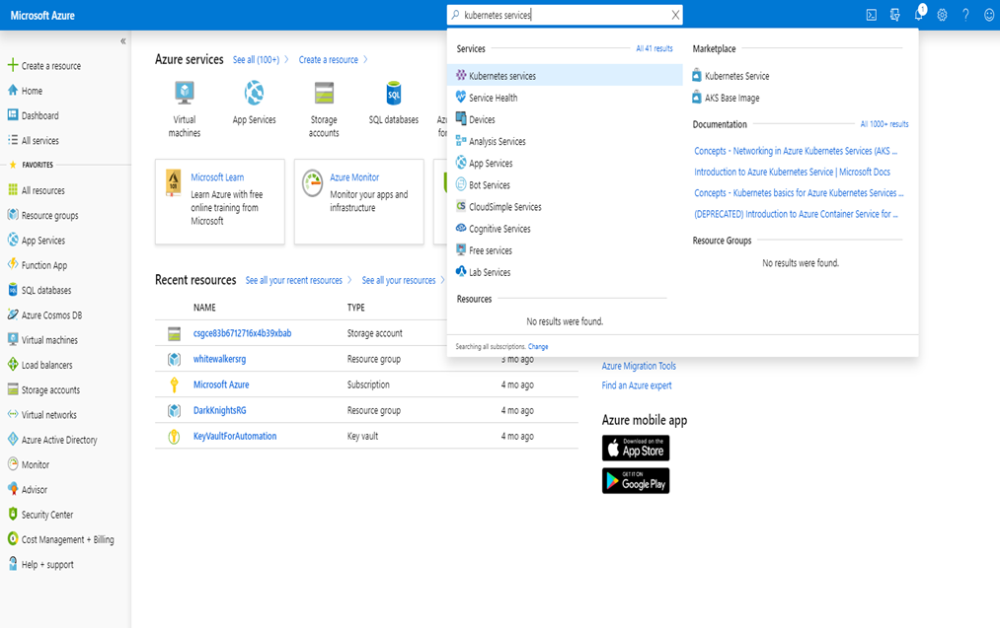
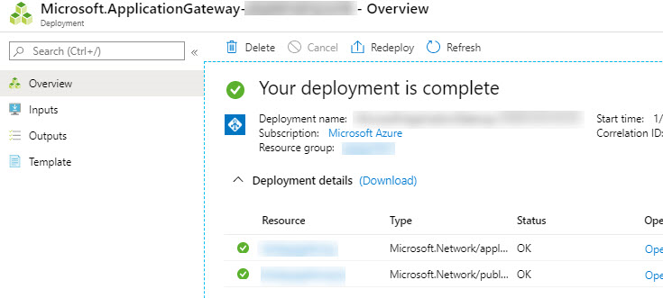
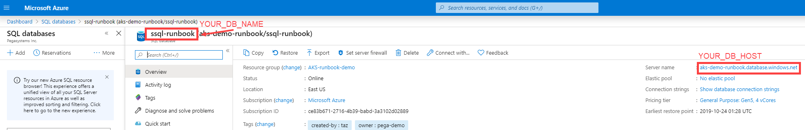
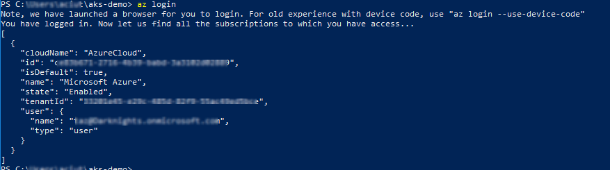
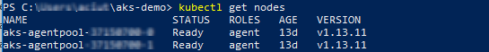
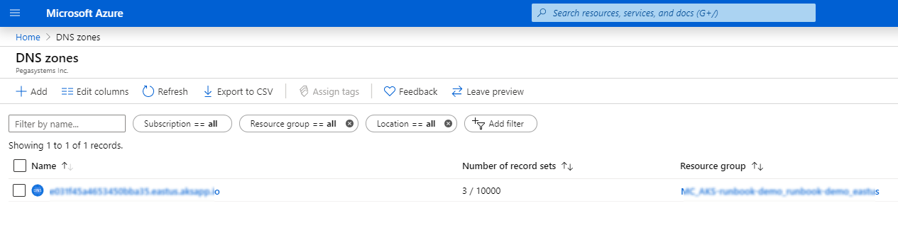

Deploying Pega Platform on an AKS cluster
===============================

Deploy Pega Platform™ on an Azure Kubernetes Service (AKS) cluster set up in your Microsoft Azure account. The procedures are written for any level of user, from a system administrator to a  development engineer who is interested in learning how to install and deploy Pega Platform onto an AKS cluster.

Pega helps enterprises and agencies quickly build business apps that deliver the outcomes and end-to-end customer experiences that you need. Use the procedures in this guide, to install and deploy Pega software onto an AKS cluster without much experience in either AKS configurations or Pega Platform deployments.

Create a deployment of Pega Platform on which you can implement a scalable Pega application in an AKS cluster. You can use this deployment for a Pega Platform development environment. By completing these procedures, you deploy Pega Platform on an AKS cluster with an SQL database instance and two clustered virtual machines (VMs).

Deployment process overview
------------------------

Use Kubernetes tools and the customized orchestration tools and Docker images to orchestrate a deployment in a AKS cluster that you create for the deployment:

1. Prepare your local system:

    - To prepare a local Linux system, install required applications and configuration files - [Preparing your local Linux system – 45 minutes](prepping-local-system-runbook-linux.md).

    - To prepare a local Windows system, install required applications and configuration files -
    [Preparing your local Windows 10 system – 45 minutes](prepping-local-system-runbook-windows.md).

2. Create an AKS cluster and an SQL database resource in your Azure account - [Prepare your AKS resources – 45 minutes](#prepare-your-aks-resources--60-minutes).

3.  Customize a configuration file with your AKS details and use the command-line tools, kubectl and Helm, to install and then deploy Pega Platform onto your AKS cluster - [Deploying Pega Platform using Helm charts – 90 minutes](#installing-and-deploying-pega-platform-using-helm-charts--90-minutes).

4. Configure your network connections in the DNS management zone of your choice so you can log in to Pega Platform - [Logging in to Pega Platform – 10 minutes](#logging-in-to-pega-platform--10-minutes).

To understand how Pega maps Kubernetes objects with Pega applications and services, see [How Pega Platform and applications are deployed on Kubernetes](https://community.pega.com/knowledgebase/articles/cloud-choice/how-pega-platform-and-applications-are-deployed-kubernetes).

Assumptions and prerequisites
-----------------------------

This guide assumes:

- You have a basic familiarity with running commands from a Windows 10 PowerShell with Administrator privileges or a Linux command prompt with root privileges.

- You use open source packaging tools on Windows or Linux to install applications onto your local system.

The following account, resources, and application versions are required for use in this document:

- A Microsoft Azure account with a payment method set up to pay for the Azure resources that you create and appropriate Microsoft Azure account permissions and knowledge to:

  - Create an AKS service, an SQL Database, and a storage resource.

  - Select an appropriate location in which to deploy Microsoft Azure resources;
    the document assumes your location is US East.

  - You are responsible for any financial costs incurred for your AKS resources.

- Pega Platform 8.3.1 or later.

- Pega Docker images – your deployment requires the use of a custom Docker image to install Pega Platform into a database that is used by your AKS cluster. After you build your image, you must make it available in a private Docker registry. To build your own image from the base image that Pega provides, you must have:

  - A DockerHub account to which you will push your final image to a private DockerHub repository. The image you build with Pega-provided components cannot be shared in a public DockerHub repository.

  - The Docker application downloaded to your local system, either Linux- or Windows-based. Log into your DockerHub account from the Docker application on your local system.

- A Pega Platform distribution kit downloaded and extracted on your local system.

- Helm 3.0 or later. Helm is only required to use the Helm charts and not to use the Kubernetes YAML examples directly. For more information, see the [Helm documentation portal](https://helm.sh/docs/).

- kubectl – the Kubernetes command-line tool that you use to connect to and manage your Kubernetes resources.

Prepare your AKS resources – 60 minutes
-----------------------------------

In order to deploy Pega Platform to an AKS environment, you must create the AKS resources that the deployment will use in your Azure account. This section covers the details necessary to create an  AKS cluster and an SQL database resource.


### Creating an AKS cluster

To deploy Pega using an AKS cluster, create the cluster in an existing project in your Microsoft Azure account. During deployment the required Kubernetes configuration file is copied into the cluster. Create a cluster with two VMs that have sufficient memory and CPU resources to support a deployment of Pega Platform that can perform under high workloads.

1. In a web browser, login to Microsoft Azure Portal (<https://portal.azure.com/>)
    with your credentials.

2. Search for **Kubernetes services** and then select it in the dropdown list.



3. Click **+Add**.

4. On the **Create an AKS Kubernetes service page**, on the **Basics** tab
    page, add details to the following required fields for this Kubernetes
    service:

    a. In **Project Details**, select your Azure **Subscription** (the default is
    **Microsoft Azure**).

    b. In **Resource Group** area, select the appropriate group or click **Create new** and provide a name.

    c. In **Cluster details**, enter a **Kubernetes cluster name**.

    d. Select a **Region** that is appropriate for your deployment.

    e. Select the default **Kubernetes version** that is version 1.13.10 or later.

    f. For **DNS name prefix**, enter a prefix that your organization requires or use the default prefix. Azure creates the prefix based on the **Kubernetes cluster name** that you provided.

    g. In Primary node pool specify the size of your VMs for this service.

    Select VMs of type **D8Sv3** (8 vcpus, 32 GiB memory). Change the filters if you cannot find this type using the search function.

    h. Specify a **Node count**. Note that the cost varies with different VM
    configurations.

    Pega recommends standard deployments use at least two nodes.

5. Click **Next: Scale**.

6. In the **Scale** tab page, use the default settings: **Virtual nodes** and **VM Scale sets** both set to **Disabled**.

7. Click **Next: Authentication**.

8. In the **Authentication** tab page, add details to the following required
    fields for this Kubernetes service:

    a. In **Cluster Infrastructure** area/**Service principal**, select a service principal:

    - If you do not have an existing service principal leave the field at the default to create a new service principal.

    - If you have an existing service principal, click **Configure service principal**, and then,in the **Configure service principal** window, select **Use existing** and enter the **Service principal client ID** and **client secret**.

    b. In **Kubernetes authentication and authorization**, leave Enable RBAC
    toggled to **Yes**.

9. Click **Next: Networking**.

10. In the **Networking** tab page, add details to the following required fields
    for this Kubernetes service:

    a. Ensure that **HTTP application routing** is **Disabled**.

    b. Ensure that **Networking configuration** is set to **Advanced**.

    c. In **Configure virtual networks**, leave the default network and address settings unless you have specific, advanced networking requirements.

11. Click **Next: Monitoring**.

12. In the **Monitoring** tab page, in **Azure Monitor**, accept the defaults to
    **Enable container monitoring** to use the default analytics workspace
    to store monitoring data.

13. Click **Next: Tags**.

14. In the **Tags** tab page, add any tags with which you want to identify resources such as owner, user, and organization name by using the **Name** and **Value** tags.

    Tags can help clarify billing details for your AKS resources.

15. Click **Next: Review + create**.

    Azure runs a validation and when validated, your service is ready to be created.

16. Check your configurations on the **Create and Review** tab.

    Azure validates your configuration.

17. Click **Create**.

    A deployment progress page displays the status of your deployment until it is complete, which takes about 15 minutes. When complete, the Azure UI displays all of the resources created for your AKS cluster in **Deployment details**:


### Creating an SQL database resource

AKS deployments require you to install Pega Platform software in an SQL database. After creating an SQL database, obtain the database and server name to customize your pega.yaml Helm chart with this information.

1. In a web browser, login to Microsoft Azure Portal (https://portal.azure.com/)
    with your credentials.

2. Search for **SQL Databases** and select it in the dropdown list.

3. Click **+Add**.

4. On the **Create SQL Database** page, in the **Basics** tab page, add details
    to the following required fields for this database server:

5. In **Project details**, select your Azure Subscription.

6. In **Resource Group**, select the same group you specified or created for
    your AKS cluster.

7. In **Database details**, enter a database server name.

8. In **Server**, click **Create new**.

9. In the **New server** window, enter a name, security details, select the
    same **Region** as in your AKS cluster, and then click **OK**.

10. Set **Want to use SQL elastic pool?** with the default: **No**.

11. In **Compute + storage server**, click configure database and then
    select Gen5 compute hardware and a minimum of **4** vCores and **32 GB**
    storage.

12. Click **Next: Networking**.

13. On the **Networking** tab page, add details to the following required fields
    for this database server:

    a. In the **Network connectivity** area, for a **Connectivity method**, select
    **Public endpoint**.

    b. In the **Firewall rules** area, for **Allow Azure services and resources to
    access this server**, select **Yes**.

    c. In the **Firewall rules** area, for **Add current client IP address**,
    select **Yes**.

14. Click **Next: Additional settings**.

15. On the **Additional settings** tab page, use the following settings for this
    database server:

    - **Data source**: **None**

    - **Database collation**: use the default

    - **Enable Advanced data security**: Not now

16. Click **Next: Tags**.

17. On the **Tags** tab page, add any tags with which you want to identify resources such as owner, user, and organization name by using the **Name** and **Value** tags.

    Tags can help clarify billing details for your AKS resources.

21. Click **Next: Review + create**.

22. On the **Create and Review** tab.

    Azure validates your configuration for your parameters.

23. Click **Create**.

    A deployment progress page displays the status of your server creation until it is complete, which takes about 5 minutes. When complete, the Azure UI displays all of the resources created for your SQL database deployment details:


### Creating an Application Gateway Resource

Create an Application Gateway for the deployment load balancer.  After creating the Application Gateway, note the name and resource group in which you created the Application Gateway. You must add these details to the Addons helm chart you configured in [your local Linux system](prepping-local-system-runbook-linux.md) or  [your local Windows 10 system](prepping-local-system-runbook-windows.md).

1. In a web browser, log in to Microsoft Azure Portal (https://portal.azure.com/)
with your credentials.

2. Search for **Application Gateway** and select it in the dropdown list.

3. Click **+Add**.

4. On the **Create an Application Gateway** page, on the **Basics** tab page, add details to the following required fields:

   a. Select the **Resource Group** in which you created your cluster.

   b. In **Instance Details**, enter an unique name and choose an appropriate region.

   c. In **Configure virtual network**, select the Virtual Network in which you created your cluster, then select a different subnet from the one you selected for cluster.

   `Note: Selecting the same subnet in this field is not supported and results in an error.`

   d. Click **Next: Frontends.**

5. In **Frontends** tab page, add details:

   a. For **Frontend IP address type**, select **Public**.

   b. In **Public IP address**, click on **Create new**:

    The **Add a public IP address** option opens.

   c. Select an unique name and click **Ok**.

   d. Click **Next : Backends**.

6. In **Backends** tab page, add details:

   a. Click **Add a backend pool** and do the following:

    - In the **Add a backend pool** dialogue box, enter a unique \<*backend pool name*\>.

    - In **Add backend pool without targets** select **Yes**.

   b. Click **Next : Configuration**.

With the Frontends and Backends configurations complete, create Routing rules that include - Listener, Backend targets, and an HTTP setting.

7. Click on **Add a rule**.

   a. In **Add a routing rule**  dialog, enter a unique **Rule name**.

   b. Configure **Listener** settings.

   - Enter a unique **Listener Name**.
   - For **Frontend IP**, select **Public**.
   - For **Protocol**, select **HTTP**.
   - For as **Port**, enter **80**.
   - Leave the remaining settings at the default value.
   - Click the **Backend targets** tab.

   c. Configure **Backend targets** settings.

   - For **Backend Pool**, select **Target type**.
   - For **Backend Target**, select the backend pool that you created in Step 6.
   - For **HTTP Setting**, click **Create new**.

   d.  Configure **Add an HTTP Setting**.

   - Enter an unique **HTTP Setting Name**.
   - For **Backend Protocol**, select **HTTP**.
   - For **Backend port**, enter Give **80**.
   - Leave the remaining settings at the default value.

8. Click **Next : Tags**.

9. Add any necessary, required tags.

10. Click **Next : Review + Create**.

11. Click **Create**.

A deployment progress page displays the status of your server creation until it is complete, which takes about 5 minutes. When complete, the Azure UI displays all of the resources created for your Application Gateway details:



### Locating your SQL database details

After you finalize your SQL database configuration and you are ready to deploy, locate the the SQL Server name for
**YOUR_DB_HOST** and the SQL database name for **YOUR_DB_NAME** for this database URL string in the “pega” Helm chart:

`jdbc:sqlserver://**YOUR_DB_HOST**:1433;databaseName=**YOUR_DB_NAME**;selectMethod=cursor;sendStringParametersAsUnicode=false:`

1. In the upper left corner of your Azure portal, click the **Portal** menu.

2. In the **Favorites** section, select **SQL databases**.

3. In the **Name** column, select the database name that you just created to display
    it details.

4. Locate **YOUR_DB_NAME** and **YOUR_DB_HOST**. 

    You need these names to update your pega.yaml Helm chart.



Installing and deploying Pega Platform using Helm charts – 90 minutes
---------------------------------------------------------------------

To deploy Pega Platform by using Helm, customize the pega.yaml Helm chart that holds the specific settings for your deployment needs and then run a series of Helm commands to complete the deployment.

An installation with deployment will take about 90 minutes total, because a Pega Platform installation in your PostgreSQL database takes up to an hour.

Adding the Pega configuration files to your Helm installation on your local system
----------------------------------------------------------------------------------

Pega maintains a repository of Helm charts that are required to deploy Pega Platform using Helm, including a generic version of the following charts. After you add the repository to your local system, you can customize these Pega configuration files for your Pega Platform deployment:

- pega/pega - Use this chart to set customization parameters for your deployment. You will modify this chart later in the deployment tasks.

- pega/addons – Use this chart to install any supporting services and tools which your Kubernetes environment will require to support a Pega deployment: the required services, such as a load balancer or metrics server, that your deployment requires depend on your cloud environment. For instance you can specify whether you want to use a generic load-balancer or use one that is offered in your Kubernetes environment, such as in AKS or EKS. The runbooks provide instructions to deploy these supporting services once per Kubernetes environment when you install the addons chart, regardless of how many Pega Infinity instances are deployed.

To customize these files, you must download them from the repository to your local system, edit them with a text editor, and then save them to your local system using the same filename. In this set of tasks, you will focus on the pega/addons.yaml file; in the environment-specific runbook that you are using in the section, **Update the Helm chart values**, you will update the pega.yaml file.

1. To add the Pega repository to your Helm installation, enter:

    `$ helm repo add pega https://dl.bintray.com/pegasystems/pega-helm-charts`

2. To verify the new repository, you can search it by entering:

```bash
  $ helm search repo pega
  NAME        CHART VERSION   APP VERSION     DESCRIPTION
  pega/pega   1.2.0                           Pega installation on kubernetes
  pega/addons 1.2.0           1.0             A Helm chart for Kubernetes
```

These two charts in this /charts/pega folder of the pega-helm-charts repository, pega and addons, require customization for your deployment of Pega Platform.

### Updating the addons.yaml Helm chart values

Use the provided example addons.yaml file to configure the use of an Application Gateway Ingress Controller (AGIC).

1. Download the example pega/addons [addons.yaml](./resources/addons-aks.yaml) to the \<local filepath\>/aks-demo.

   This example addons file already specifies the use of an Application Gateway Ingress Controller (AGIC). You must complete the configuration with details from your AKS environment before you can deploy Pega Platform into your environment.

   When you install the addons namespace, you will specify this example file for the configuration details.

2. Use a text editor to open the addons-aks.yaml file and update the following parameters in the chart based on your AKS requirements:

  - Specify your Azure subscription ID with the `appgw.subscriptionId: <YOUR.SUBSCRIPTION_ID>` parameter.

  - Specify the Azure resource group in which you created the Application Gateway with the `appgw.resourceGroup: <RESOURCE_GROUP_NAME>` parameter.

  - Specify the name of the Application Gateway with the `appgw.name: <APPLICATION-GATEWAY-NAME>` parameter.

  - To restrict all Ingresses to be exposed over a private IP address, set the `appgw.usePrivateIP: true` parameter; to allow other ingresses, set the `appgw.usePrivateIP: false` parameter.

  - To configure authentication, REVIEWERS: need to complete this section
  , set the `armAuth.type: servicePrincipal` parameter and set the `armAuth.secretJSON: <SECRET_JSON_CREATED_USING_ABOVE_COMMAND>` parameter.

  - To configure Role-Based Access Control (RBAC) to match the RBAC setting in your environment, REVIEWERS: please review, set the `rbac.enabled: true` parameter.

3. Save the file.

### Add any known, customized settings for Pega to your deployment

The Pega deployment model supports advanced configurations to fit most existing
clients' needs. If you are a Pega client and have known, required customizations
for your deployment and you already use the following files to add your known
customizations, you can copy those configurations into the configuration files
Pega added for this purpose in the [pega-helm-charts](https://github.com/pegasystems/pega-helm-charts) repository folder, pega-helm-charts/charts/pega/config/deploy:

- context.xml: add additional required data sources

- prlog4j2.xml: modify your logging configuration, if required

- prconfig.xml: adjust the standard Pega Platform configuration with known,
    required settings

Make these changes before you begin deploying Pega Platform using Helm charts.

### Updating the pega.yaml Helm chart values

To deploy Pega Platform, configure the parameters in the pega.yaml Helm chart to your deployment resource. Pega maintains a repository of Helm charts that are required to deploy Pega Platform by using Helm, including a generic version of this chart. To configure parameters this file, download it from the repository to your local system, edit it with a text editor, and then save it with the same filename. To simplify the instruction, you can download the file to the \gke-demo folder you have already created on your local system. 

Configure the parameters so the pega.yaml Helm chart matches your deployment resources in these areas:

- Specify that this is an AKS deployment.

- Credentials for your DockerHub account in order to access the required Docker images.

- Access your Azure SQL database.

- Install the version of Pega Platform that you built into your Docker installation image.

- Specify host names for your web and stream tiers.


1. To download the pega.yaml Helm chart to the \<local filepath>\aks-demo, enter:

`$ helm inspect values pega/pega > /home/<local filepath>/aks-demo/pega.yaml`

2. Use a text editor to open the pega.yaml file and update the following parameters in the chart based on your AKS requirements:

| Chart parameter name    | Purpose                                   | Your setting |
|-------------------------|-------------------------------------------|--------------|
| provider:               | Specify an AKS deployment.                 | provider:"aks"|
| actions.execute:        | Specify a “deploy” deployment type.       | execute: "deploy"   |
| Jdbc.url:               | Specify the server and database name for your Pega Platform installation.   | <ul><li>url: “jdbc:sqlserver://**YOUR_DB_HOST_NAME**:1433; databaseName=**YOUR_DB_NAME**; selectMethod=cursor; sendStringParametersAsUnicode=false” </li><li>To locate **YOUR_DB_HOST_NAME** and **YOUR_DB_NAME** of your Azure SQL database, see [Locating your SQL database details](#locating-your-sql-database-details).</li></ul> |
| Jdbc.driverClass:       | Specify the driver class for this type of database. | driverClass: "com.microsoft.sqlserver.jdbc.SQLServerDriver"                                              |
| Jdbc.dbType:            | Specify the database type.                | dbType: "mssql”    |
| Jdbc.driverUri:         | Specify the database driver Pega Platform uses during the deployment. For AKS, we can obtain the URL of the required 7.4.1. driver file that is publicly available in the referenced Maven repository.                              | driverUri: "https://repo1.maven.org/maven2/com/microsoft/sqlserver/mssql-jdbc/7.4.1.jre11/mssql-jdbc-7.4.1.jre11.jar" |
| Jdbc: username: password: | Set the security credentials for your database server to allow installation of Pega Platform into your database.           | <ul><li>username: "\<name of your database user\>"</li><li> password: "\<password for your database user\>"</li></ul>     |
| jdbc.rulesSchema: jdbc.dataSchema:  | Set the names of both your rules and the data schema to the values that Pega Platform uses for these two schemas.      | rulesSchema: "rules" dataSchema: "data" |
| docker.registry.url: username: password: | Map the host name of a registry to an object that contains the “username” and “password” values for that registry. For more information, search for “index.docker.io/v1” in [Engine API v1.24](https://docs.docker.com/engine/api/v1.24/). | <ul><li>url: “https://index.docker.io/v1/” </li><li>username: "\<DockerHub account username\>"</li><li> password: "\< DockerHub account password\>"</li></ul> |
| docker.pega.image:       | Refer to the latest Pega Platform deployment image on DockerHub.  | <ul><li>Image: "pegasystems/pega:latest" </li><li>For a list of default images that Pega provides: <https://hub.docker.com/r/pegasystems/pega-ready/tags></li></ul> |
| upgrade:    | Do not set for installations or deployments. | upgrade: for non-upgrade, keep the default value. |
| tier.name: ”web” tier.ingress.domain:| Set a host name for the pega-web service of the DNS zone. | <ul><li>domain: "\<the host name for your web service tier\>" </li><li>tier.ingress.tls: set to `true` to support HTTPS in the ingress and pass the SSL certificate in the cluster using a secret. For details, see step 12 in the section, **Deploying Pega Platform using the command line**.</li></ul>|
| tier.name: ”stream” tier.ingress.domain: | Set the host name for the pega-stream service of the DNS zone.   | <ul><li>domain: "\<the host name for your stream service tier\>" </li><li>Your stream tier host name should comply with your networking standards.</li><li>tier.ingress.tls: set to `true` to support HTTPS in the ingress and pass the SSL certificate in the cluster using a secret. For details, see step 12 in the section, **Deploying Pega Platform using the command line**.</li><li>To remove the exposure of a stream from external network traffic, delete the `service` and `ingress` blocks in the tier.</li></ul>|
| installer.image:        | Specify the Docker image you built to install Pega Platform. | <ul><li>Image: "\<your installation Docker image :your tag\>" </li><li>You created this image in  [Preparing your local Linux system](prepping-local-system-runbook-linux.md)</li></ul>|
| installer. adminPassword:                | Specify a password for your initial log in to Pega Platform.    | adminPassword: "\<initial password\>"  |

3. Save the file.

### Deploying Pega Platform using the command line

A Helm installation and a Pega Platform installation are separate processes. The Helm install command uses Helm to install your deployment as directed in the Helm charts, one in the **charts\\addons** folder and one in the **charts\\pega** folder.

In this document, you specify that the Helm chart always “deploys” by using the setting, actions.execute: “deploy”. In the following tasks, you overwrite this function on your *initial* Helm install by specifying `--set global.actions.execute:install-deploy`, which invokes an installation of Pega Platform using your installation Docker image and then
automatically followed by a deploy. In subsequent Helm deployments, you should not use the override argument, `--set global.actions.execute=`, since Pega Platform is already installed in your database.

1. Do one of the following:

- Open Windows PowerShell running as Administrator on your local system and change the location to the top folder of your aks-demo folder that you created in [Preparing your local Windows 10 system](prepping-local-system-runbook-windows.md).

`$ cd <local filepath>\aks-demo`

- Open a Linux bash shell and change the location to the top folder of your aks-demo directory that you created in [Preparing your local Linux system](prepping-local-system-runbook-linux.md).

    `$ cd /home/<local filepath>/aks-demo`

2. To use the Azure CLI to log into your account, enter:

    `$ az login`

A new web browser window opens, which prompts you to log into your Azure account.

3. Log into the Azure account that you want use to deploy Pega Platform.

    After you log into your Azure home page, ensure that you see confirmation
information in your command prompt. For example, in a Windows PowerShell you'll see confirmation of your credentials similar to this screen shot.



If you cannot log into your Azure home page or see that the Azure CLI does not recognize your account correctly, contact your Microsoft account representative.

4. In the upper right corner of your web browser, click **Portal**.

    You are brought to your Azure home page.

5. In the **Recent resources** area, click your cluster to review the name and the resource group with which it is associated.

6. To prepare your environment using the Azure CLI, enter:

```bash
$ az aks get-credentials --resource-group <resource-group-name> --name <cluster-name>
Merged "runbook-demo" as current context in <local filepath>\<cluster-name>.kube\config
```

7. To use the kubectl command to view the VM nodes created when you created the AKS cluster, enter:

    `$ kubectl get nodes`



8. To establish a required cluster role binding setting so that you can launch the Kubernetes dashboard, enter:

    `$ kubectl create clusterrolebinding dashboard-admin -n kube-system --clusterrole=cluster-admin --serviceaccount=kube-system:kubernetes-dashboard`

9. To launch the Kubernetes dashboard to view your AKS resources before you deploy Pega Platform by replacing the names specific to your AKS cluster, enter:

    `$ az aks browse --resource-group <resource-group-name> --name <cluster-name>`


    You can now view your deployment details using the Kubernetes dashboard. Use this dashboard to review the status of your deployment. Without a deployment, only AKS resources display. The dashboard does not display your AKS cluster name or your resource name, which is expected behavior.

    To continue using the Kubernetes dashboard to see the progress of your deployment, keep this PowerShell or Linux shell open.

10. Do one of the following:

- Open a new Windows PowerShell running as Administrator on your local system and change the location to the top folder of your aks-demo folder that you created in [Create a local folder to access all of the configuration files](prepping-local-system-runbook-windows.md#creating-a-local-folder-to-access-all-of-the-configuration-files).

    `$ cd \<local filepath>\aks-demo`

- Open a new Linux bash shell and change the location to the top folder of your aks-demo directory that you created in [Create a local folder to access all of the configuration files](prepping-local-system-runbook-linux.md#creating-a-local-folder-to-access-all-of-the-configuration-files).

    `$ cd /home/<local filepath>/aks-demo`

11. To create namespaces in preparation for the pega.yaml and addons.yaml deployments, enter:

```bash
    $ kubectl create namespace mypega
    namespace/mypega created
    $ kubectl create namespace pegaaddons
    namespace/pegaaddons created
```

12. (Optional: To support HTTPS connectivity with Pega Platform) To pass the appropriate certificate to the ingress using a Kubernetes secret, enter:

    `$ kubectl create secret tls <secret-name> --cert <cert.crt-file> --key <private.key-file> --namespace <namespace-name>`

To use a secrets file, make the following changes in the pega.yaml file for the exposed tiers in your deployment:

```yaml
ingress:
  domain: "web.dev.pega.io"
  tls:
    enabled: true
    secretName: <secret-name>
    useManagedCertificate: false
```

13. To ensure the certificate is working in the cluster, enter:

    `$ kubectl get secrets --namespace <namespace-name>`

14. To install the addons chart, which you updated in [Preparing your AKS resources](#prepare-your-aks-resources--60-minutes), enter:

```bash
    $ helm install addons pega/addons --namespace pegaaddons --values addons-aks.yaml
    NAME: addons
    LAST DEPLOYED: Fri Jan  3 18:58:28 2020
    NAMESPACE: pegaaddons
    STATUS: deployed
    REVISION: 1
```

A successful pegaaddons deployment returns details of deployment progress. For further verification of your deployment progress, you can refresh the Kubernetes dashboard and look in the `pegaaddons` **Namespace** view.

15. To deploy Pega Platform for the first time by specifying to install Pega Platform into the database specified in the Helm chart when you install the pega.yaml Helm chart, enter:

```bash
    $ helm install mypega-aks-demo pega/pega --namespace mypega --values pega.yaml --set global.actions.execute=install-deploy
    NAME: mypega-aks-demo
    LAST DEPLOYED: Fri Jan  3 19:00:19 2020
    NAMESPACE: mypega-aks-demo
    STATUS: deployed
    REVISION: 1
    TEST SUITE: None
```

For subsequent Helm installs, use the command `helm install mypega-aks-demo pega/pega --namespace mypega --values pega.yaml` to deploy Pega Platform and avoid another Pega Platform installation.

A successful Pega deployment immediately returns details that show progress for your deployment.

16. Refresh the Kubernetes dashboard that you opened in step 9. If you closed the dashboard, open a new command prompt running as Administrator and relaunch the web browser as directed in Step 9.

17. In the dashboard, in **Namespace** select the **mypega-aks-demo** view and then click on the **Pods** view.

    Note: A deployment takes about 15 minutes for all resource configurations to initialize; however a full Pega Platform installation into the database can take up to an hour.

    To follow the progress of an installation, use the dashboard. For subsequent deployments, you do not need to do this. Initially, while the resources make requests to complete the configuration, you will see red warnings while the configuration is finishing, which is expected behavior.

18. To view the status of an installation, on the Kubernetes dashboard, select **Jobs**, locate the **pega-db-install** job, and click the logs icon on the right side of that row.

    After you open the logs view, you can click the icon for automatic refresh to see current updates to the install log.

19. To see the final deployment in the Kubernetes dashboard after about 15 minutes, refresh the **mypega-aks-demo** namespace pods.

    A successful deployment does not show errors across the various workloads. The **mypega-aks-demo** Namespace **Overview** view shows charts of the percentage of complete tiers and resources configurations. A successful deployment has 100% complete **Workloads**.

Logging in to Pega Platform – 10 minutes
---------------------------------------

After you complete your deployment, as a best practice, associate the host name of the pega-web tier ingress with the IP address that the deployment load balancer assigned to the tier during deployment. The host name of the pega-web tier ingress used in this demo, **aks.web.dev.pega.io**, is set in the pega.yaml file in the following lines:

```yaml
tier:
  - name: "web"

    service:
      # Enter the domain name to access web nodes via a load balancer.
      #  e.g. web.mypega.example.com
      domain: "**aks.web.dev.pega.io**"
```

To log in to Pega Platform with this host name, assign the host name with the same IP address that the deployment load balancer assigned to the web tier. This final step ensures that you can log in to Pega Platform with your host name, on which you can independently manage security protocols that match your networking infrastructure standards.

You can view the networking endpoint that is associated with your AKS deployment using the `kubectl` command.

`$ kubectl get services --namespace mypega-aks-demo`

The pega-web tier external endpoint (the IP address and port number) are displayed. Port 80 is used for HTTP traffic, which means that you cannot use HTTPS encryption to access the web-tier in a web browser; instead, use the domain name that you configured for the pega-web tier ingress.

To manually associate the host name of the pega-web tier ingress with the tier's external endpoint, use the DNS lookup management system of your choice. As an example, if your organization has a AKS **DNS zone** configured to manage your DNS lookups, you can create a new record set with the pega-web tier the host name and add the IP address of the pega-web tier.

The mypega-web node is the only tier with an externally exposed IP address. Note the external IP address that the load-balancer gives to the web node: this is the IP address which in order to log into Pega Platform with your host name.

1. In a web browser, login to Microsoft Azure Portal (https://portal.azure.com/)
    with your credentials.

2. Search for **DNS zones** and select it in the dropdown list.

    You are brought to the DNS zones for your Azure account.



3. In the **Name** column, click on the **DNS zone** for your deployment.

4. To associate the IP address of the pega-web tier with domain name of the pega-web tier ingress that you configured during your deployment, add a **Record set** to your DNS zone for this host name:

    a. Click **+Record** set

    b.  In the **Name** field, enter **"\<the host name for your web service tier\>"**.

    c.  In the **Type** field, select **A**.

    d.  In **Alias record set** the configuration remains **No**.

    e.  Set **TTL** to **5** and **TTL Unit** to Minutes.

    f.  In the IP Address field, enter the IP from the pega-web tier.

    g.  Click **OK**.

    The new record set appears in the list of record sets for this Azure DNS zone.


With the ingress host name name associated with this IP address in your DNS service, you can log in to Pega Platform with a web browser using the URL: `http://\<pega-web tier ingress host name>/prweb`.


