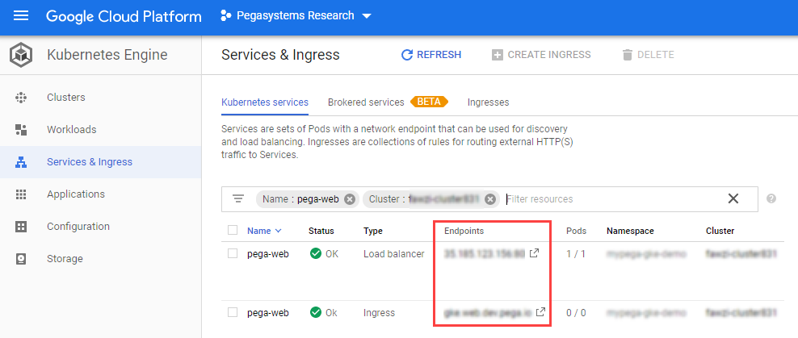

# Deploying Pega Platform on a GKE cluster

Deploy Pega Platform™ on a Google Kubernetes Engine (GKE) cluster using a PostgreSQL database you configure in Google Cloud Platform (GCP). The following procedures are written for any level of user, from a system administrator to a development engineer who is interested in learning how to install and deploy Pega Platform onto a GKE cluster.

Pega helps enterprises and agencies quickly build business apps that deliver the outcomes and end-to-end customer experiences that you need. Use the procedures in this guide, to install and deploy Pega software onto a GKE cluster without much experience in either GKE configurations or Pega Platform deployments.

Create a deployment of Pega Platform on which you can implement a scalable Pega application in a GKE cluster. You can use this deployment for a Pega Platform development environment. By completing these procedures, you deploy Pega Platform on a GKE cluster with a PostgreSQL database instance and two clustered virtual machines (VMs).

## Deployment process overview

Use Kubernetes tools and the customized orchestration tools and Docker images to orchestrate a deployment in a GKE cluster that you create for the deployment:

1. Prepare your local system using [Preparing your local Linux system – 45 minutes](prepping-local-system-runbook-linux.md) – install required applications and configuration files.

2.  Create a GKE cluster and a Postgres database in an SQL instance in your Google Cloud Platform (GPC) account - [Preparing your GKE resources – 45 minutes](#preparing-your-gke-resources--45-minutes).

3. Customize a configuration file with your GKE details and use the command-line tools, kubectl and Helm, to install and then deploy Pega Platform onto your GKE cluster - [Deploying Pega Platform using Helm charts – 90 minutes](#installing-and-deploying-pega-platform-using-helm-charts--90-minutes).

4. Configure your network connections in the DNS management zone of your choice so you can log in to Pega Platform - [Logging in to Pega Platform – 10 minutes](#logging-in-to-pega-platform--10-minutes).

To understand how Pega maps Kubernetes objects with Pega applications and services, see [Understanding the Pega deployment architecture](https://community.pega.com/knowledgebase/articles/client-managed-cloud/cloud/understanding-pega-deployment-architecture).

## Assumptions and prerequisites

This guide assumes that you use open source packaging tools on a Linux distribution to install applications onto your local system.

The following account, resources, and application versions are required for use in this document:

- A GCP account with a payment method set up to pay for the GCP resources you create and appropriate GCP account permissions and knowledge to:

  - Access an existing GCP project for your GKE resources.

  - Create an SQL Instance.

  - Select an appropriate location to deploy your database resource and GKE cluster. The cluster and PostgreSQL database into which you install Pega Platform must be in the same location.

  You are responsible for any financial costs incurred for your GCP resources.

- Pega Platform 8.3.1 or later.

- Pega Docker images – your deployment requires the use of several Docker images that you download and make available in a private Docker registry. For step-by-step details, see [Downloading and managing Pega Platform docker images (linux)](prepping-local-system-runbook-linux.md#downloading-and-managing-pega-platform-docker-images) or [Downloading and managing Pega Platform docker images (windows)](prepping-local-system-runbook-windows.md#downloading-and-managing-pega-platform-docker-images).

- Helm 3.0 or later. Helm is only required to use the Helm charts and not to use the Kubernetes Yaml examples directly. For more information, see the [Helm documentation portal](https://helm.sh/docs/).

- kubectl – the Kubernetes command-line tool that you use to connect to and manage your Kubernetes resources.

- gcloud - the Google Cloud SDK command-line tool that you use to connect to your GKE cluster.

## Creating a Google Cloud Platform project - 5 minutes

To deploy Pega Platform to a GKE cluster, you must create a Google Cloud project in which you will create your Kubernetes cluster resources.

1. Using the web browser of your choice, log in to [GCP](https://cloud.google.com/) with your GCP account credentials.

2. Click **Console** next to your profile name to open the GCP console page.

3. In the search tool, search for "Manage resources" and select **Manage resources IAM & admin** to display the **Google Cloud Platform console > Manage resources** page.

4. Click **+CREATE PROJECT**.

5. In the New Project window, enter a unique **Project name**, select a **Location**, if appropriate, and click **CREATE**.

With the new project created, you can proceed with completing the preparation of your local system.

## Preparing your GKE resources – 45 minutes

Obtain your GKE credentials so you can create a GKE cluster and configure the required PostgreSQL database in a GCP account. You can create a PostgreSQL database in any environment if the IP address of the database is available to your GKE cluster.

### Creating a GKE cluster

To deploy Pega using a GKE cluster, create the cluster in an existing  project in your Google Cloud account. During deployment the required Kubernetes configuration file is copied into the cluster. Create a multi-zonal cluster with two VMs with sufficient memory and CPU resources to support a deployment of Pega Platform that can perform under high workloads.

You can create this cluster using gcloud or the Google Cloud Console. This demo provides steps using the Google Cloud Console using the web browser of your choice; for steps to create the cluster using gcloud in the Google Cloud SDK, see the **gcloud** tab on the page [Creating a multi-zonal cluster]( https://cloud.google.com/kubernetes-engine/docs/how-to/creating-a-multi-zonal-cluster).

To log in to your demo cluster, you must have the following information:

- The name of your GKE cluster

- The login credentials for your Google account: username and password

- Whether any SSL information is required to authenticate your login and if so, the appropriate authentication certificates.

To use the Google Cloud Console:

1. In a web browser, log in to <https://cloud.google.com/> and navigate to your
    **Console** in the upper right corner.

2. In your **Google Cloud Platform** console, use the **Navigation Menu** to go
    to the **Kubernetes Engine > Clusters** page.

3. On the **Kubernetes Clusters** page, click **+CREATE CLUSTER**.

4. Choose the **Standard cluster** template.

5. On the Standard cluster page, enter the following details:

    a. **Name** - enter the permanent name you use to refer to your GKE cluster.

    b. **Location type** - select **Zonal** or **Regional**.

    c. **Zone** - select an appropriate zone or region from the list.

    d. **Master version** - select an appropriate version. (The default version is most appropriate.)

    e. **Node pools: default-pool - Number of Nodes** -  enter "2".

    f. **Node pools: default-pool - Machine configuration > Machine family** - select the "General-purpose" tab.

    g. **Node pools: default-pool - Machine configuration > Series** - select "N1".

    h. **Node pools: default-pool - Machine configuration > Machine type** - select n1-highmem-4 (4 vCPU **Cores** and 26 GB **Memory**) for a minimum deployment; however using n1-highmem-8 (8 vCPU **Cores** and 52 GB **Memory**) is suitable for deployments that will process heavier workloads.

6. In **Additional features**, select **Enable Kubernetes dashboard**.

    The remaining fields can be left to their default values; however, if you have specific cluster requirements, update the template with your changes before proceeding.

7. Scroll to the bottom of the page and click **Create**.

### Creating a database resource

Pega Platform deployments on GKE require you to install Pega Platform software in an SQL database. After you create an SQL instance that is available to your GKE cluster, you must create a postSQL database in which to install Pega Platform. When you are finished, you will need the database name and the SQL instance IP address that you create in this procedure in order to add this information to your pega.yaml Helm chart.

#### Creating an SQL instance

Create an SQL instance that is available to your GKE cluster. In this example, the SQL instance is created in GCP; however, you can create or use a database resource that is available to the GKE cluster.

1. Use a web browser to log in to <https://cloud.google.com/> and navigate to your
    **Console** in the upper right corner.

2. In your **Google Cloud Platform** console, use the **Navigation Menu** to go
    to **Storage** grouping and select **SQL**.

3. On the **SQL** page, click **+Create Instance**.

4. On the **Choose your database engine** window, click **Choose PostgreSQL**.

5. On the **Create PostgreSQL instance** page, add details to the following
    required fields for this database server:

    a. **Instance ID**, enter a database server ID. (demo-runbook-sql1)

    b. **Default user password**, enter a “postgres” user password.

    c. Select an appropriate **Region** and **Zone** for your database server. Select the same zone or region that you used to create your GKE cluster.

    d. **Database version**, select **PostgreSQL 11 or 12**.

    e. **Configuration options \> Connectivity**, select **Public IP**, click **+ Add Network**, enter a **Name** and **Network** of one or more IP addresses to whitelist for this PostgreSQL database, and click **Done**.

    As a best practice, add the following IP addresses: your local system from where you install helm, the worker nodes of the cluster. One method for finding the IP address for worker nodes of the cluster is to view the nodes in your GKE cluster with kubectl command-line tool and then use the command options, `kubectl describe nodes | grep ExternalIP`.

6. In **Configuration options \> Machine type and storage**:

    a. **Machine type**, select n1-highmem-2 (2 vCPU **Cores** and 13 GB **Memory**).

    b. **Network throughput**, select **SSD (Recommended)**.

    c. **Storage capacity**, enter **20 GB** and select **Enable automatic storage increases**.

7. Configure the remaining setting using the default values:

    a. **Auto backups and high availability** - select an automated backup time.

    b. **Flags** - no flags are required.

    c. **For Maintenance** - any preference is supported.

    d.  **Labels**, no labels are required. Labels can help clarify billing details for your GKE resources.

8. Click **Create**.

  A deployment progress page displays the status of your deployment until it is complete, which takes up to 5 minutes. When complete, the GCP UI displays all of the SQL resources in your account, which includes your newly created SQL instance:


#### Creating a database in your SQL instance

Create a PostgreSQL database in your new SQL instance for the Pega Platform installation. Use the database editing tool of your choice to log into your SQL instance and create this new PostgreSQL database. The following example was completed using pgAdmin 4.

1. Log into your SQL instance.

    You can find your access information and login credentials, by selecting the SQL instance in the GCP console.

2. In the database editor tool, navigate to Databases and create a new database.

   No additional configuration is required.

With your SQL service IP address and your new database name, you are ready to continue to the next section.

## Installing and deploying Pega Platform using Helm charts – 90 minutes

To deploy Pega Platform by using Helm, customize the pega.yaml Helm chart that holds the specific settings for your deployment needs and then run a series of Helm commands to complete the deployment.

An installation with deployment will take about 90 minutes total, because a Pega Platform installation in your PostgreSQL database takes up to an hour.

### Adding the Pega configuration files to your Helm installation on your local system

Pega maintains a repository of Helm charts that are required to deploy Pega Platform using Helm, including a generic version of the following charts. After you add the repository to your local system, you can customize these Pega configuration files for your Pega Platform deployment:

- pega/pega - Use this chart to set customization parameters for your deployment. You will modify this chart later in the deployment tasks.

- pega/backingservices - Use this chart to set customization parameters for the Pega-provided Search and Reporting Service (SRS) your deployment. You will modify this chart later in the deployment tasks.

To customize these files, you must download them from the source github repository to your local system, edit them with a text editor, and then save them to your local system using the same filename.

1. To add the Pega repository to your Helm installation, enter:

    `$ helm repo add pega https://pegasystems.github.io/pega-helm-charts`

2. To verify the new repository, you can search it by entering:

```
  $ helm search repo pega
  NAME                  CHART VERSION   APP VERSION     DESCRIPTION
  pega/pega             2.2.0                           Helm chart to configure required installation and deployment configuration settings in your environment for your deployment.
  pega/addons           2.2.0           1.0             Helm chart to configure supporting services and tools in your environment for your deployment.
  pega/backingservices  2.2.0                           Helm Chart to provision the latest Search and Reporting Service (SRS) for your Pega Infinity deployment.
```

The addons charts is not required for GKE deployments of Pega Platform. Use of the backingservices chart is optional, but recommended for Pega Infinity 8.6 and later.

#### Updating the backingservices.yaml Helm chart values for the SRS (Supported when installing or upgrading to Pega Infinity 8.6 and later)

To configure the parameters in the backingservices.yaml file, download the file in the charts/backingservices folder, edit it with a text editor, and then save it to your local system using the same filename.

1. To download the backingservices.yaml Helm chart to the \<local filepath>\gke-demo, enter:

   `$ helm inspect values pega/backingservices > <local filepath>/gke-demo/backingservices.yaml`

2. Use a text editor to open the backingservices.yaml file and update the following parameters in the chart based on your GKE requirements:

| Chart parameter name              | Purpose                                   | Your setting |
|:---------------------------------|:-------------------------------------------|:--------------|
| global.imageCredentials.registry: username: password:  | Include the URL of your Docker registry along with the registry “username” and “password” credentials. | <ul><li>url: “\<URL of your registry>” </li><li>username: "\<Registry account username\>"</li><li> password: "\<Registry account password\>"</li></ul> 
| srs.deploymentName:        | Specify unique name for the deployment based on org app and/or SRS applicable environment name.      | deploymentName: "acme-demo-dev-srs"   |
| srs.srsRuntime.srsImage: | Specify the Pega-provided SRS Docker image that you downloaded and pushed to your Docker registry. | srs.srsRuntime.srsImage: "\<Registry host name:Port>my-pega-srs:\<srs-version>". For `<srs-version>` tag details, see [SRS Version compatibility matrix](../charts/backingservices/charts/srs/README.md#srs-version-compatibility-matrix).    |
| srs.srsStorage.provisionInternalESCluster: | Enabled by default to provision an Elasticsearch cluster. | <ul><li>Set srs.srsStorage.provisionInternalESCluster:`true` and run `$ make es-prerequisite NAMESPACE=<NAMESPACE_USED_FOR_DEPLOYMENT>`</li><li>Set srs.srsStorage.provisionInternalESCluster:`false` if you want to use an existing, externally provisioned ElasticSearch cluster. </li></ul> |
| srs.srsStorage.domain: port: protocol: basicAuthentication: awsIAM: requireInternetAccess: | Disabled by default. Enable only when srs.srsStorage.provisionInternalESCluster is false and you want to configure SRS to use an existing, externally provisioned Elasticsearch cluster. For an Elasticsearch cluster secured with Basic Authentication, use `srs.srsStorage.basicAuthentication` section to provide access credentials. For an AWS Elasticsearch cluster secured with IAM role based authentication, use `srs.srsStorage.awsIAM` section to set the aws region where AWS Elasticsearch cluster is hosted. For unsecured managed ElasticSearch cluster do not configure these options. | <ul><li>srs.srsStorage.domain: "\<external-es domain name\>"</li> <li>srs.srsStorage.port: "\<external es port\>"</li> <li>srs.srsStorage.protocol: "\<external es http protocol, `http` or `https`\>"</li>     <li>srs.srsStorage.basicAuthentication.username: "\<external es `basic Authentication username`\>"</li>     <li>srs.srsStorage.basicAuthentication.password: "\<external es `basic Authentication password`\>"</li>     <li>srs.srsStorage.awsIAM.region: "\<external AWS es cluster hosted `region`\>"</li><li> srs.srsStorage.requireInternetAccess: "\<set to `true` if you host your external Elasticsearch cluster outside of the current network and the deployment must access it over the internet.\>"</li></ul>     |
| elasticsearch: volumeClaimTemplate: resources: requests: storage: | Specify the Elasticsearch cluster disk volume size. Default is 30Gi, set this value to at least three times the size of your estimated search data size | <ul><li>elasticsearch: volumeClaimTemplate: resources: requests: storage:  "\<30Gi>” </li></ul> |

3. Save the file.

4. To use an internal Elasticsearch cluster (srs.srsStorage.provisionInternalESCluster:true) for your deployment, you must run `$ make es-prerequisite NAMESPACE=<NAMESPACE_USED_FOR_DEPLOYMENT>`.

#### Add any known, customized settings for Pega to your deployment

The Pega deployment model supports advanced configurations to fit most existing
clients' needs. If you are a Pega client and have known, required customizations
for your deployment and you already use the following files to add your known
customizations, you can copy those configurations into the configuration files
Pega added for this purpose in the [pega-helm-charts](https://github.com/pegasystems/pega-helm-charts) repository folder, pega-helm-charts/charts/pega/config/deploy:

- context.xml: add additional required data sources

- prlog4j2.xml: modify your logging configuration, if required

- prconfig.xml: adjust the standard Pega Platform configuration with known,
    required settings

Make these changes before you begin deploying Pega Platform using Helm charts.

#### Updating the pega.yaml Helm chart values

To configure the parameters in the pega.yaml Helm, download the file in the charts/pega folder, edit it with a text editor, and then save it to your local system using the same filename.

Configure the following parameters so the pega.yaml Helm chart matches your deployment resources in these areas:

- Specify that this is an GKE deployment.

- Credentials for your DockerHub account in order to access the required Docker images.

- Access your GCP SQL database.

- Access your ElasticSearch service (For 8.6 and later, Pega recommends deploying your service using an SRS cluster).

- Install the version of Pega Platform that you built into your Docker installation image.

- Specify host names for your web and stream tiers.

- Enable encryption of traffic between the ingress/load balancer and the pods by specifying SSL certificates for your web tiers.

- Enable Hazelcast client-server model for Pega Platform 8.6 and later.

- For new deployments, Pega recommends deploying Pega Platform using an externalized Kafka configuration as a stream service provider to use your own managed Kafka infrastructure. Deployment of stream with externalized Kafka configuration requires Pega Infinity 8.4 or later.

1. To download the pega.yaml Helm chart to the \<local filepath\>/gke-demo, enter:

`$ helm inspect values pega/pega > /<local filepath>/gke-demo/pega.yaml`

2. Use a text editor to open the pega.yaml file and update the following parameters in the chart based on your GKE requirements:

    | Chart parameter name    | Purpose                                   | Your setting |
    |-------------------------|-------------------------------------------|--------------|
    | provider:               | Specify a GKE deployment.                 | provider:"gke"|
    | actions.execute:        | Specify a “deploy” deployment type.       | execute: "deploy"   |
    | Jdbc.url:               | Specify the database IP address and database name for your Pega Platform installation.        | <ul><li>url: "jdbc:postgresql://**localhost**:5432/**dbName**"</li><li>where **localhost** is the public IP address you configured for your database connectivity and **dbName** is the name you entered for your PostgreSQL database in [Creating a database resource](#creating-a-database-resource).</li></ul>  |
    | Jdbc.driverClass:       | Specify the driver class for a PostgreSQL database. | driverClass: "org.postgresql.Driver"                |
    | Jdbc.dbType:            | Specify PostgreSQL database type.         | dbType: "postgres”   |
    | Jdbc.driverUri:         | Specify the database driver Pega Platform uses during the deployment.| <ul><li>driverUri: "latest jar file available” </li><li>For PostgreSQL databases, use the URL of the latest PostgreSQL driver file that is publicly available at <https://jdbc.postgresql.org/download.html>.</li></ul> |
    | Jdbc: username: password: | Set the security credentials for your database server to allow installation of Pega Platform into your database.   |<ul><li>username: "\<name of your database user\>" </li><li>password: "\<password for your database user\>"</li><li>For GCP PostgreSQL databases, the default user is “postgres”.</li></ul> |
    | jdbc.rulesSchema: jdbc.dataSchema:  | Set the names of both your rules and the data schema to the values that Pega Platform uses for these two schemas.      | rulesSchema: "rules" dataSchema: "data" |
    | customArtifactory.authentication: basic.username: basic.password: apiKey.headerName: apiKey.value: | To download a JDBC driver from your custom artifactory which is secured with Basic or APIKey Authentication. Use `customArtifactory.authentication.basic` section to provide access credentials or use `customArtifactory.authentication.apiKey` section to provide APIKey value and dedicated APIKey header details. | <ul><li>basic.username: "\<Custom artifactory basic Authentication username\>"</li><li>basic.password: "\<Custom artifactory basic Authentication password\>"</li><li>apiKey.headerName: "\<Custom artifactory dedicated APIKey Authentication header name\>"</li><li>apiKey.value: "\<Custom artifactory APIKey value for APIKey authentication\>"</li> </ul> |
    | customArtifactory.certificate: | Custom artifactory SSL certificate verification is enabled by default. If your custom artifactory domain has a self-signed SSL certificate, provide the certificate. You can disable SSL certificate verification by setting `customArtifactory.enableSSLVerification` to `false`;however, this setting establishes an insecure connection. | <ul><li> certificate: "\<custom artifactory SSL certificate to be verified\>"</li></ul> |
    | docker.registry.url: username: password: | Include the URL of your Docker registry along with the registry “username” and “password” credentials. | <ul><li>url: “\<URL of your registry>” </li><li>username: "\<Registry account username\>"</li><li> password: "\<Registry account password\>"</li></ul> |
    | docker.pega.image:       | Specify the Pega-provided `Pega` image you downloaded and pushed to your Docker registry.  | Image: "<Registry host name:Port\>/my-pega:\<Pega Platform version>" |
    | tier.name: ”web” tier.ingress.domain:| Set a host name for the pega-web service of the DNS zone. Pega supports specifying certificates for an ingress using the same methods GKE supports. Note that if you configure both secrets and pre-shared certificates on the ingress, the load balancer ignores the secrets and uses the list of pre-shared certificates. For details, see [Using multiple SSL certificates in HTTP(s) load balancing with Ingress](https://cloud.google.com/kubernetes-engine/docs/how-to/ingress-multi-ssl).  | <ul><li>tier.name: "\<the host name for your web service tier\>" </li><li>Assign this host name with an external IP address and log into Pega Platform with this host name in the URL. Your web tier host name must comply with your networking standards and be available as an external IP address.</li><li>tier.ingress.tls: set to `true` to support HTTPS in the ingress. See step 12 to support the management of the certificates in your deployment.</li></ul> |
    | tier.name: ”web” tier.service.tls:| Set this parameter as `true` to encrypt the traffic between the load balancer/ingress and pods. Beginning with Helm version `2.2.0` Pega provides a default self-signed certificate; Pega also supports specifying your own CA certificate.  | <ul><li>tier.service.tls.enabled: set to `true` to enable the traffic encryption </li><li>tier.service.tls.port: 443</li><li>tier.service.tls.targetPort: 8443</li><li>tier.service.tls.keystore: The base64 encoded content of the keystore file. Leave this value empty to use the default, Pega-provided self-signed certificate.</li><li>tier.service.tls.keystorepassword: the password of the keystore file</li><li>tier.service.tls.cacertificate: the base64 encrypted content of the root CA certificate. You can leave this value empty for GKE deployments.</li><li>tier.service.traefik.enabled: set to `false` as this option is for `k8s` provider not for `GKE`</li></ul> |
    | tier.name: ”stream” (Deprecated) tier.ingress.domain: | The "Stream tier" is deprecated, please enable externalized Kafka service configuration under External Services.Set the host name for the pega-stream service of the DNS zone.   | <ul><li>domain: "\<the host name for your stream service tier\>" </li><li>Your stream tier host name should comply with your networking standards.</li><li>tier.ingress.tls: set to `true` to support HTTPS in the ingress and pass the SSL certificate in the cluster using a secret. For details, see step 12 in the section, **Deploying Pega Platform using the command line**.</li><li>To remove the exposure of a stream from external network traffic, delete the `service` and `ingress` blocks in the tier.</li></ul> |
    | pegasearch: | For Pega Platform 8.6 and later, Pega recommends using the chart 'backingservices' to enable Pega SRS. To deploy this service, you must configure your SRS cluster using the backingservices Helm charts and provide the SRS URL for your Pega Infinity deployment. | <ul><li>externalSearchService: true</li><li>externalURL: pegasearch.externalURL For example, http://srs-service.mypega-pks-demo.svc.cluster.local </li></ul> |
    | installer.image:  | Specify the Docker `installer` image for installing Pega Platform that you pushed to your Docker registry. | Image: "\<Registry host name:Port>/my-pega-installer:\<Pega Platform version>" |
    | installer. adminPassword:                | Specify an initial administrator@pega.com password for your installation.  This will need to be changed at first login. The adminPassword value cannot start with "@".  | adminPassword: "\<initial password\>"  |
    | hazelcast: | For Pega Platform 8.6 and later, Pega recommends using Hazelcast in client-server model. Embedded deployment would not be supported in future platform releases. | |
    | hazelcast.image:        | Specify the Pega-provided `clustering-service` Docker image that you downloaded and pushed to your Docker registry. | Image: "\<Registry host name:Port>/my-pega-installer:\<Pega Platform version>" |
    | hazelcast.enabled: hazelcast.replicas: hazelcast.username: hazelcast.password: | Either to enable Hazelcast in client-server model and configure the number of replicas and username & passowrd for authentication | <ul><li>enabled: true/false <br/> Set to true if you want to deploy pega platform in client-server Hazelcast model, otherwise false. *Note: Set this value as false for Pega platform versions below 8.6, if not set the installation will fail.* </li><li>replicas: <No. of initial server members to join(3 or more based on deployment)> </li><li>username: "\<UserName for authentication\>" </li><li> password: "\<Password for authentication\>" </li></ul> |
   | stream.enabled: stream.bootstrapServer: stream.securityProtocol: stream.trustStore: stream.trustStorePassword: stream.keyStore: stream.keyStorePassword: stream.saslMechanism: stream.jaasConfig: stream.streamNamePattern: stream.replicationFactor: stream.external_secret_name:| Enable an externalized kafka configuration to connect to your existing stream service, by configuring these required settings | <ul><li>enabled: true/false <br/> Set to true if you want to deploy Pega Platform to use an externalized Kafka configuration, otherwise leave set to false. Note: Pega recommends enabling an externalized Kafka configuration and has deprecated using a stream tier configuration starting at version 8.7.</li><li>bootstrapServer: Provide your existing Kafka broker URLs separated by commas.</li><li>securityProtocol: Provide the required security protocol that your deployment will use to communicate with your existing brokers. Valid values are: PLAINTEXT, SSL, SASL_PLAINTEXT, SASL_SSL.</li><li> trustStore: When using a trustStore certificate, you must also include a Kubernetes secret name, that contains the trustStore certificate, in the global.certificatesSecrets parameter. Pega deployments only support trustStores using the Java Key Store (.jks) format.</li><li> trustStorePassword: If required, provide keyStore value in plain text.</li><li> keyStore: When using a keyStore certificate, you must also include a Kubernetes secret name, that contains the keyStore certificate, in the global.certificatesSecrets parameter. Pega deployments only support keyStores using the Java Key Store (.jks) format.<li> keyStorePassword: If required, provide keyStore value in plain text.</li><li> jaasConfig: If required, provide jaasConfig value in plain text.</li><li> saslMechanism: If required, provide SASL Mechanism. Supported values are: PLAIN, SCRAM-SHA-256, SCRAM-SHA-512.</li> <li> streamNamePattern: By default, topics originating from Pega Platform have the "pega-" prefix, so that it is easy to distinguish them from topics created by other applications. Pega supports customizing the name pattern for your Externalized Kafka configuration for each deployment.</li> <li> replicationFactor: Your replicationFactor value cannot be more than the number of Kafka brokers and 3.</li> <li> external_secret_name: To avoid exposing trustStorePassword, keyStorePassword, and jaasConfig parameters, leave the values empty and configure them using an External Secrets Manager, making sure that you configure the keys in the secret in the order:STREAM_TRUSTSTORE_PASSWORD, STREAM_KEYSTORE_PASSWORD and STREAM_JAAS_CONFIG. Enter the external secret name.</li></ul> |
   
3. Save the file.

#### (Optional) Add Support for providing DB credentials using External Secrets Operator

Create two files following the Kubernetes documentation for External Secrets Operator [External Secrets Operator](https://external-secrets.io/v0.5.3/) :
  •	An external secret file that specifies what information in your secret to fetch.
  •	A secret store to define access how to access the external and placing the required files in your Helm directory.

- Copy both files into the pega-helm-charts/charts/pega/templates directory of your Helm
- Update repo to the latest-> helm repo update pega https://pegasystems.github.io/pega-helm-charts
- Update Pega.yaml file to refer to the external secret manager for DB password.

### Deploying Pega Platform using the command line

A Helm installation and a Pega Platform installation are separate processes. The Helm install command uses Helm to install your deployment as directed in the Helm charts, one in the **charts\\addons** folder and one in the **charts\\pega** folder.

In this document, you specify that the Helm chart always “deploys” by using the setting, actions.execute: “deploy”. In the following tasks, you overwrite this function on your *initial* Helm install by specifying `--set global.actions.execute:install-deploy`, which invokes an installation of Pega Platform using your installation Docker image and then
automatically followed by a deploy. In subsequent Helm deployments, you should not use the override argument, `--set global.actions.execute=`, since Pega Platform is already installed in your database.

1. Open a Linux bash shell and change the location to the top folder of your gke-demo directory that you created in [Preparing your local Linux system](prepping-local-system-runbook-linux.md).

`$ cd /home/<local filepath>/gke-demo`

2. To use the gcloud command to ensure you are logged into your account, enter:

```bash
$ gcloud info
Google Cloud SDK [274.x.y]
...
Account: [your Google account]
Project: [your Google project]

Current Properties:
  [core]
    project: [your Google project]
    custom_ca_certs_file: [any files you used for SSL certification]
    account: [your Google account]
    disable_usage_reporting: [your response during authorization]
  [compute]
    zone: [your selected zone]
```

3. To view the status of all of your GKE clusters and verify the name of the cluster for the Pega Platform deployment, enter:

`$ gcloud container clusters list`

4. To download the cluster Kubeconfig access credential file, which is specific to your cluster, into your \<local filepath\>/.kube directory, enter:

    If your gcloud configuration includes the zone you chose for your cluster, you can skip adding the `-z <zone-name>` option to the command.

```bash
$ gcloud container clusters get-credentials <cluster-name> -z <zone-name>
Fetching cluster endpoint and auth data.
kubeconfig entry generated for <cluster-name>.
```

5. To view the nodes in your GKE cluster, including cluster names and status, enter:

```bash
    $ kubectl get nodes
    NAME                                             STATUS   ROLES    AGE    VERSION
    gke-demo-default-pool-abc   Ready    <none>   3d2h   v1.13.11-gke.14
    gke-demo-default-pool-def   Ready    <none>   3d2h   v1.13.11-gke.14
```

6. To establish a required cluster role binding setting so that you can launch the Kubernetes dashboard, enter:

```bash
$ kubectl create clusterrolebinding dashboard-admin -n kube-system --clusterrole=cluster-admin --serviceaccount=kube-system:kubernetes-dashboard
```

7. To start the proxy server for the Kubernetes dashboard, enter:

    `$ kubectl proxy`

8. To access the Dashboard UI, open a web browser and navigate to the following URL:

    `http://localhost:8001/api/v1/namespaces/kube-system/services/https:kubernetes-dashboard:/proxy/`

9. In the **Kubernetes Dashboard** sign in window, choose the appropriate authentication method:

- To use a cluster Kubeconfig access credential file: select **Kubeconfig**, navigate to your \<local filepath\>/.kube directory and select the config file. Click **SIGN IN**.

- To use a cluster a Kubeconfig token: select **Token** and paste your Kubeconfig token into the **Enter token** area. Click **SIGN IN**.

    You can now view your deployment details using the Kubernetes dashboard. After you install Pega software, you can use this dashboard to review the status of all of the related Kubernetes objects used in your deployment; without a deployment, only Kubernetes cluster objects display. The dashboard does not display your GKE cluster name or your resource name, which is expected behavior.

    To continue using the Kubernetes dashboard to see the progress of your deployment, keep this Linux shell open.

10. Open a new Linux bash shell and change the location to the top folder of your gke-demo directory.

    `$ cd /home/<local filepath>/gke-demo`

11. To create namespaces in preparation for the pega.yaml and addons.yaml deployments, enter:

```bash
    $ kubectl create namespace mypega-gke-demo
    namespace/mypega-gke-demo created
    $ kubectl create namespace pegaaddons
    namespace/pegaaddons created
```

12. (Optional:) To support HTTPS connectivity with Pega Platform, you can specify certificates by using the following three methods:

- Kubernetes secret - To pass the appropriate certificate to the ingress using a Kubernetes secret, enter:

    `$ kubectl create secret tls <secret-name> --cert \<platform>-demo\<cert.crt-file> --key \<platform>-demo\<private.key-file> --namespace <namespace-name>`

For each certificate you manage with a Kubernetes secret, ensure you associate each ingress with a unique certificate and a private key. If you configure multiple certificates, GCP recognizes the first certificate in the list as the primary certificate. If you associate both secrets and pre-shared certificates to an ingress, the load balancer ignores the secrets and uses the list of pre-shared certificates.

To use a secrets file, make the following changes in the pega.yaml file for the exposed tiers in your deployment:

```yaml
ingress:
  domain: "web.dev.pega.io"
  tls:
    enabled: true
    secretName: <secret-name>
    useManagedCertificate: false
```

- Pre-shared certificates which you have uploaded to your Google Cloud project - To upload the appropriate certificates your Google Cloud project, enter:

    `$ gcloud compute ssl-certificates create demo-ingress --certificate \<platform>-demo\<cert.crt-file> --private-key \<platform>-demo\<private.key-file>`

For each pre-shared certificate you add to your Google Cloud project, ensure you associate each ingress with a unique certificate and a private key. If you configure multiple pre-shared certificates in your GCP project, GCP recognizes the first certificate in the list as the primary certificate. If you associate both secrets and pre-shared certificates to an ingress, the load balancer ignores the secrets and uses the list of pre-shared certificates.

To use the pre-shared certificate, make the following changes in the pega.yaml file for the exposed tiers in your deployment:

```yaml
ingress:
  domain: "web.dev.pega.io"
  tls:
    enabled: true
    useManagedCertificate: false
    ssl_annotation: ingress.gcp.kubernetes.io/pre-shared-cert: demo-ingress
```

- Google-managed SSL certificate. Make the following changes in the pega.yaml file for the exposed tiers in your deployment:

Note: Using a static IP address is not mandatory; if you do not use one, remove the ssl_annotation. To use a static IP address, you must create the static IP address during the cluster configuration, then add it using the ssl_annotation.

```yaml
ingress:
  domain: "web.dev.pega.io"
  tls:
    enabled: true
    useManagedCertificate: true
    ssl_annotation: kubernetes.io/ingress.global-static-ip-name: web-ip-address
```

13. For Pega Platform 8.6 and later installations, to install the backingservices chart that you updated in [Updating the backingservices.yaml Helm chart values (Supported when installing or upgrading to Pega Infinity 8.6 and later)](#Updating the backingservices.yaml Helm chart values (Supported when installing or upgrading to Pega Infinity 8.6 and later)), enter:

   ```yaml
   $ helm install backingservices pega/backingservices --namespace mypega-gke-demo --values backingservices.yaml
   ```

The `mypega-gke-demo` namespace used for pega deployment can also be used for backingservice deployment that you configured in backingservices.yaml helm chart.

14. To deploy Pega Platform for the first time by specifying to install Pega Platform into the database specified in the Helm chart when you install the pega.yaml Helm chart, enter:

```bash
    $ helm install mypega-gke-demo pega/pega --namespace mypega-gke-demo --values pega.yaml --set global.actions.execute=install-deploy
    NAME: mypega-gke-demo
    LAST DEPLOYED: Fri Jan  3 19:00:19 2020
    NAMESPACE: mypega-gke-demo
    STATUS: deployed
    REVISION: 1
    TEST SUITE: None
```

For subsequent Helm installs, use the command `helm install mypega-gke-demo pega/pega --namespace mypega-gke-demo` to deploy Pega Platform and avoid another Pega Platform installation.

A successful Pega deployment immediately returns details that show progress for your `mypega-gke-demo` deployment.

14. Refresh the Kubernetes dashboard that you opened in Step 11. If you closed the dashboard, start the proxy server for the Kubernetes dashboard as directed in Step 10, and relaunch the web browser as directed in Step 11.

15. In the dashboard, in **Namespace** select the `mypega-gke-demo` view and then click on the **Pods** view. Initially, some pods will have a red status, which means they are initializing:


    Note: A deployment takes about 15 minutes for all resource configurations to initialize; however a full Pega Platform installation into the database can take up to an hour.

    To follow the progress of an installation, use the dashboard. For subsequent deployments, you do not need to do this. Initially, while the resources make requests to complete the configuration, you will see red warnings while the configuration is finishing, which is expected behavior.

16. To view the status of an installation, on the Kubernetes dashboard, select **Jobs**, locate the **pega-db-install** job, and click the logs icon on the right side of that row.

    After you open the logs view, you can click the icon for automatic refresh to see current updates to the install log.

17. To see the final deployment in the Kubernetes dashboard after about 15 minutes, refresh the `mypega-gke-demo` namespace pods.

A successful deployment does not show errors across the various workloads. The `mypega-gke-demo` Namespace **Overview** view shows charts of the percentage of complete tiers and resources configurations. A successful deployment has 100% complete **Workloads**.

## Logging in to Pega Platform – 10 minutes

After you complete your deployment, as a best practice, associate the host name of the pega-web tier ingress with the IP address that the deployment load balancer assigned to the tier during deployment. The host name of the pega-web tier ingress used in this demo, **gke.web.dev.pega.io**, is set in the pega.yaml file in the following lines:

```yaml
tier:
  - name: "web"

    service:
      # Enter the domain name to access web nodes via a load balancer.
      #  e.g. web.mypega.example.com
      domain: "**gke.web.dev.pega.io**"
```

To log in to Pega Platform with this host name, assign the host name with the same IP address that the deployment load balancer assigned to the web tier. This final step ensures that you can log in to Pega Platform with your host name, on which you can independently manage security protocols that match your networking infrastructure standards.

You can view the networking endpoints associated with your GKE deployment by using the Google Cloud Platform console. From the Navigation menu, go to the **Kubernetes Engine > Clusters > Services & Ingresses** page to display the IP address of this tier and the pega-web tier ingress host name. Use the page filter to look at the pega-web resources in your cluster.



To manually associate the host name of the pega-web tier ingress with the tier endpoint, use the DNS lookup management system of your choice. As an example, if your organization has a GCP **Cloud DNS** that is configured to manage your DNS lookups, create a record set that specifies the pega-web tier the host name and add the IP address of the pega-web tier.

For GCP **Cloud DNS** documentation details, see [Quickstart](https://cloud.google.com/dns/docs/quickstart).

### Logging in by using the domain name of the web tier

With the ingress host name name associated with this IP address in your DNS service, you can log in to Pega Platform with a web browser using the URL: `http://\<pega-web tier ingress host name>/prweb`.


