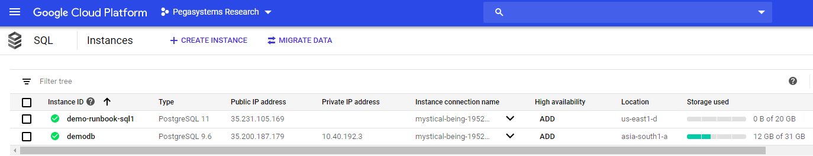
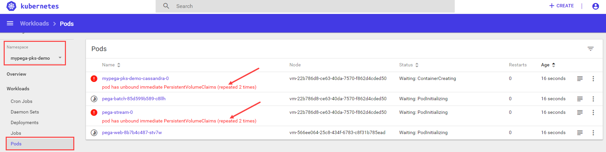
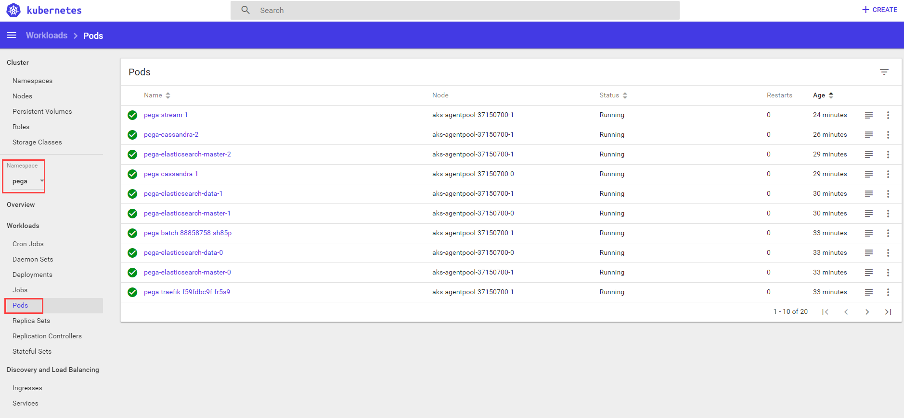
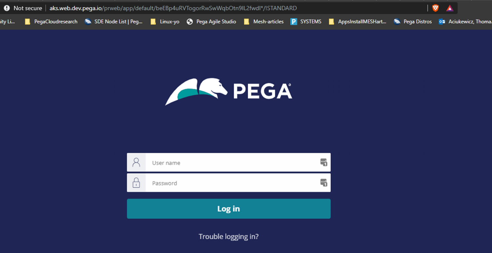

# Deploying Pega Platform on a TKGI cluster

Deploy Pega Platform™ on a VMware Tanzu Kubernetes Grid Integrated Edition (TKGI) cluster using a PostgreSQL database you configure in Google Cloud Platform (GCP). TKGI was formerly knows Pivotal Container Service (PKS). If your TKGI cluster is deployed on a different cloud, the database steps may be different. The following procedures are written for any level of user, from a system administrator to a development engineer who is interested in learning how to install and deploy Pega Platform onto a TKGI cluster.

Pega helps enterprises and agencies quickly build business apps that deliver the outcomes and end-to-end customer experiences that you need. Use the procedures in this guide, to install and deploy Pega software onto a TKGI cluster without much experience in either TKGI configurations or Pega Platform deployments.

Create a deployment of Pega Platform on which you can implement a scalable Pega application in a TKGI cluster. You can use this deployment for a Pega Platform development environment. By completing these procedures, you deploy Pega Platform on a TKGI cluster with a PostgreSQL database instance and two clustered virtual machines (VMs).

## Deployment process overview

Use Kubernetes tools and the customized orchestration tools and Docker images to orchestrate a deployment in a TKGI cluster that you create for the deployment:

1. Prepare your local system:

    - To prepare a local Linux system, install required applications and configuration files - [Preparing your local Linux system – 45 minutes](https://github.com/pegasystems/pega-helm-charts/blob/master/docs/prepping-local-system-runbook-linux.md).

    - To prepare a local Windows system, install required applications and configuration files -
    [Preparing your local Windows 10 system – 45 minutes](https://github.com/pegasystems/pega-helm-charts/blob/master/docs/prepping-local-system-runbook-windows.md).

2. Verify access to your TKGI cluster and create an PostgreSQL instance in an account such as Google Cloud Platform (GPC) - [Prepare your TKGI resources – 45 minutes](#prepare-your-resources--45-minutes).

3. Customize a configuration file with your TKGI details and use the command-line tools, kubectl and Helm, to install and then deploy Pega Platform onto your TKGI cluster - [Deploying Pega Platform using Helm charts – 90 minutes](#installing-and-deploying-pega-platform-using-helm-charts--90-minutes).

4. Configure your network connections in the DNS management zone of your choice so you can log in to Pega Platform - [Logging in to Pega Platform – 10 minutes](#logging-in-to-pega-platform--10-minutes).

To understand how Pega maps Kubernetes objects with Pega applications and services, see [Understanding the Pega deployment architecture](https://community.pega.com/knowledgebase/articles/client-managed-cloud/cloud/understanding-pega-deployment-architecture).

## Assumptions and prerequisites

This guide assumes:

- You have a basic familiarity with running commands from a Windows 10 PowerShell with Administrator privileges or a Linux command prompt with root privileges.

- You use open source packaging tools on Windows or Linux to install applications onto your local system.

The following account, resources, and application versions are required for use in this document:

- A GCP account with a payment method set up to pay for the GCP resources you create and appropriate GCP account permissions and knowledge to:

  - Create a PostgreSQL Database.

  - Select an appropriate location in which to deploy your database resource; the document assumes your location is US East.

  You are responsible for any financial costs incurred for your GCP resources.

- Pega Platform 8.3.1 or later.

- Pega Docker images – your deployment requires the use of several Docker images that you download and make available in a private Docker registry. For step-by-step details, see [Downloading and managing Pega Platform docker images (linux)](prepping-local-system-runbook-linux.md#downloading-and-managing-pega-platform-docker-images) or [Downloading and managing Pega Platform docker images (windows)](prepping-local-system-runbook-windows.md#downloading-and-managing-pega-platform-docker-images).

- Helm 3.0 or later. Helm is only required to use the Helm charts and not to use the Kubernetes YAML examples directly. For more information, see the [Helm documentation portal](https://helm.sh/docs/).

- kubectl – the Kubernetes command-line tool that you use to connect to and manage your Kubernetes resources.

- PKS CLI - the PKS command-line tool that you use to manage and communicate with your PKS cluster.

## Prepare your resources – 45 minutes

This section covers the details necessary to obtain your TKGI credentials and
configure the required PostgreSQL database in a GCP account. Pega supports
creating a PostgreSQL database in any environment if the IP address of
the database is available to your TKGI cluster.

### Accessing a TKGI cluster

Access to a TKGI cluster is required to deploy using TKGI. At a minimum, your cluster should be provisioned with at least two worker nodes that have 32GB of RAM in order to support the typical processing loads in a Pega Platform deployment. Pivotal supports SSL authentication, which you can request if your organization requires it.

In order to login to your cluster, you must have the following information:

- The target IP address of your TKGI API

- The login credentials: username and password

- Whether any SSL information is required to authenticate your login.

During deployment the required Kubernetes configuration file is copied into the cluster and into your default ~/.kube directory.

### Creating a database resource

TKGI deployments require you to install Pega Platform software in an PostgreSQL database. After you create an PostgreSQL instance that is available to your TKGI cluster, you must create a PostgreSQL database in which to install Pega Platform. When you are finished, you will need the database name and the PostgreSQL instance IP address which you create in this procedure in order to add this information to your pega.yaml Helm chart.

#### Creating an PostgreSQL instance

To begin, create an PostgreSQL Instance that is available to your TKGI cluster. In this example, we create an PostgreSQL instance in GCP; however, you can create or use an database resource that is available to the TKGI cluster.

1. Use a web browser to log in to <https://cloud.google.com/> and navigate to your **Console** in the upper right corner.

2. In your **Google Cloud Platform** console, use the **Navigation Menu** to go to **Storage** grouping and select **SQL**.

3. In the SQL page, click **+Create Instance**.

4. In the **Choose your database engine** screen, click **Choose PostgreSQL**.

5. In the **Create PostgreSQL instance** page, add details to the following
    required fields for this database server:

    a. In **Instance ID**, enter a database server ID.

    b. In **Default user password**, enter a “postgres” user password.

    c. Select an appropriate **Region** and **Zone** for your database server, which must be in the same zone or region as your TKGI cluster.

    d. In **Database version**, select **PostgreSQL 11**.

    e. In **Configuration options \> Connectivity**, select **Public IP**, click **+ Add Network**, enter a **Name** and **Network** of one or more IP address to whitelist for this PostgreSQL database, and click **Done**.

    You can launch the Kubernetes dashboard to view the external IP address of the nodes in your cluster; to add that IP network to the database whitelist, enter the first three sets of number,and use 0/24 for the final set in this IP range. For example: 123.123.123.0/24.

6. In **Configuration options \> Machine type and storage**:

    a. For **Machine type**, select 4 vCPU **Cores** and 15 GB **Memory**.

    b. For **Network throughput**, select **SSD (Recommended)**.

    c. For **Storage capacity**, enter **20 GB** and select **Enable automatic storage increases**.

7. Configure the remaining setting using the default values:

    a. For **Auto backups and high availability**, select backups can be automated 1AM – 5AM in a single zone.

    b. For **Flags**, no flags are required.

    c. **For Maintenance**, any preference is supported.

    d. For **Labels**, no labels are required.
    
    Labels can help clarify billing details for your TKGI resources.

8. Click **Create**.

    A deployment progress page displays the status of your deployment until it is complete, which takes up to 5 minutes. When complete, the GCP UI displays all of the SQL resources in your account, which includes your newly created SQL instance:



#### Creating a database in your SQL instance

Create a PostgreSQL database in your new SQL instance for the Pega Platform installation. Use the database editing tool of your choice to log into your SQL instance and create this new PostgreSQL database. The following example was completed using pgAdmin4.

1. Use a database editor tool, such as pgadmin4, to log into your PostgreSQL instance.

    You can find your access information and login credentials, by selecting the PostgreSQL instance in the GCP console.

2. In the database editor tool, navigate to Databases and create a new database.

   No additional configuration is required.

With your SQL service IP address and your new database name, you are ready to continue to the next section.

## Installing and deploying Pega Platform using Helm charts – 90 minutes

To deploy Pega Platform by using Helm, customize the pega.yaml Helm chart that holds the specific settings for your deployment needs and then run a series of Helm commands to complete the deployment.

An installation with deployment will take about 90 minutes total, because a Pega Platform installation in your PostgreSQL database takes up to an hour.

### Adding the Pega configuration files to your Helm installation on your local system

Pega maintains a repository of Helm charts that are required to deploy Pega Platform using Helm, including a generic version of the following charts. After you add the repository to your local system, you can customize these Pega configuration files for your Pega Platform deployment:

- pega/addons – Use this chart to install any supporting services and tools which your Kubernetes environment will require to support a Pega deployment: the required services, such as a load balancer or metrics server, that your deployment requires depend on your cloud environment. For instance you can specify whether you want to use a generic load-balancer or use one that is offered in your Kubernetes environment. With the instructions in this runbook, you deploy these supporting services once per Kubernetes environment when you install the addons chart, regardless of how many Pega Infinity instances are deployed.

- pega/pega - Use this chart to set customization parameters for your deployment. You will modify this chart later in the deployment tasks.

- pega/backingservices - Use this chart to set customization parameters for the Pega-provided Search and Reporting Service (SRS) your deployment. You will modify this chart later in the deployment tasks.

To customize these files, you must download them from the source github repository to your local system, edit them with a text editor, and then save them to your local system using the same filename.

1. To add the Pega repository to your Helm installation, enter:

    `$ helm repo add pega https://pegasystems.github.io/pega-helm-charts`

2. To verify the new repository, you can search it by entering:

```
  $ helm search repo pega
  NAME                  CHART VERSION   APP VERSION     DESCRIPTION
  pega/pega             1.4.4                           Helm chart to configure required installation and deployment configuration settings in your environment for your deployment.
  pega/addons           1.4.4           1.0             Helm chart to configure supporting services and tools in your environment for your deployment.
  pega/backingservices  1.4.4                           Helm Chart to provision the latest Search and Reporting Service (SRS) for your Pega Infinity deployment
```

The pega and addons charts require customization for your organization's TGKI deployment of Pega Platform. The backingservices chart is optional, but recommended for Pega Infinity 8.6 and later.

#### Updating the addons.yaml Helm chart values

To configure the use of a the Traefik load balancer and enable EFK for log aggregation in the addons.yaml file, download the file in the charts/addons folder, edit it with a text editor, and then save it to your local system using the same filename. You must disable the Pega metric server to ensure your deployment uses the TGKI-supplied metrics server.

1. Download the example pega/addons [addons.yaml](./resources/addons-pks.yaml) to the \<local filepath\>/TKGI-demo.

   When you install the addons namespace, you will specify this example file for the configuration details.

2. Use a text editor to open the addons-aks.yaml file and update the following parameters in the chart based on your AKS requirements. The example addons file is configured to automatically deploy EFK for log aggregation. If you need to make customizations, add the appropriate parameters:

- To use the default EFK settings, you must set a domain name to access kibana from your load balancer using the `kibana.hosts: "YOUR_WEB.KIBANA.EXAMPLE.COM"` parameter.
- If your TKGI deployment already has log aggregation capabilities configured, you must disable EFK deploy by setting the `deploy_efk: &deploy_efk false` parameter.

3. Save the file.

#### Updating the backingservices.yaml Helm chart values for the SRS (Supported when installing or upgrading to Pega Infinity 8.6 and later)

To configure the parameters in the backingservices.yaml file, download the file in the charts/backingservices folder, edit it with a text editor, and then save it to your local system using the same filename.
  
1. To download the backingservices.yaml Helm chart to the \<local filepath>\TKGI-demo, enter:
  
  `$ helm inspect values pega/backingservices > <local filepath>/TKGI-demo/backingservices.yaml`
  
2. Use a text editor to open the backingservices.yaml file and update the following parameters in the chart based on your PKS requirements:
  
| Chart parameter name              | Purpose                                   | Your setting |
|:---------------------------------|:-------------------------------------------|:--------------|
| global.imageCredentials.registry: username: password:  | Include the URL of your Docker registry along with the registry “username” and “password” credentials. | <ul><li>url: “\<URL of your registry>” </li><li>username: "\<Registry account username\>"</li><li> password: "\<Registry account password\>"</li></ul> |
| srs.deploymentName:        | Specify unique name for the deployment based on org app and/or SRS applicable environment name.      | deploymentName: "acme-demo-dev-srs"   |
| srs.srsStorage.provisionInternalESCluster: | Enabled by default to provision an Elasticsearch cluster. | <ul><li>Set srs.srsStorage.provisionInternalESCluster:`true` and run `$ make es-prerequisite NAMESPACE=<NAMESPACE_USED_FOR_DEPLOYMENT>`</li><li>Set srs.srsStorage.provisionInternalESCluster:`false` if you want to use an existing, externally provisioned ElasticSearch cluster. </li></ul> |
| srs.srsStorage.domain: port: protocol: basicAuthentication: awsIAM: requireInternetAccess: | Disabled by default. Enable only when srs.srsStorage.provisionInternalESCluster is false and you want to configure SRS to use an existing, externally provisioned Elasticsearch cluster. For an Elasticsearch cluster secured with Basic Authentication, use `srs.srsStorage.basicAuthentication` section to provide access credentials. For an AWS Elasticsearch cluster secured with IAM role based authentication, use `srs.srsStorage.awsIAM` section to set the aws region where AWS Elasticsearch cluster is hosted. For unsecured managed ElasticSearch cluster do not configure these options. | <ul><li>srs.srsStorage.domain: "\<external-es domain name\>"</li> <li>srs.srsStorage.port: "\<external es port\>"</li> <li>srs.srsStorage.protocol: "\<external es http protocol, `http` or `https`\>"</li>     <li>srs.srsStorage.basicAuthentication.username: "\<external es `basic Authentication username`\>"</li>     <li>srs.srsStorage.basicAuthentication.password: "\<external es `basic Authentication password`\>"</li>     <li>srs.srsStorage.awsIAM.region: "\<external AWS es cluster hosted `region`\>"</li><li> srs.srsStorage.requireInternetAccess: "\<set to `true` if you host your external Elasticsearch cluster outside of the current network and the deployment must access it over the internet.\>"</li></ul>     |
| elasticsearch: volumeClaimTemplate: resources: requests: storage: | Specify the Elasticsearch cluster disk volume size. Default is 30Gi, set this value to at least three times the size of your estimated search data size. | <ul><li>elasticsearch: volumeClaimTemplate: resources: requests: storage:  "\<30Gi>” </li></ul> |

3. Save the file.

4. To use an internal Elasticsearch cluster (srs.srsStorage.provisionInternalESCluster:true) for your deployment, you must run `$ make es-prerequisite NAMESPACE=<NAMESPACE_USED_FOR_DEPLOYMENT>`.

#### Add any known, customized addons settings for Pega to your deployment

The Pega deployment model supports advanced configurations to fit most existing
clients' needs. If you are a Pega client and have known, required customizations
for your deployment and you already use the following files to add your known
customizations, you can copy those configurations into the configuration files
Pega added for this purpose in the [pega-helm-charts](https://github.com/pegasystems/pega-helm-charts) repository folder, pega-helm-charts/charts/pega/config/deploy:

- context.xml: add additional required data sources

- prlog4j2.xml: modify your logging configuration, if required

- prconfig.xml: adjust the standard Pega Platform configuration with known,
    required settings

Make these changes before you begin deploying Pega Platform using Helm charts.

#### Updating the pega.yaml Helm chart values

To configure the parameters in the pega.yaml fie, download the file in the charts/pega folder, edit it with a text editor, and then save it to your local system using the same filename.

Configure the following parameters so the pega.yaml Helm chart matches your deployment resources in these areas:

- Specify that this is an TKGI deployment.

- Credentials for your DockerHub account in order to access the required Docker images.

- Access your GCP PostgreSQL database.

- Access your ElasticSearch service (For 8.6 and later, Pega recommends deploying your service using an SRS cluster).

- Install the version of Pega Platform that you built into your Docker installation image.

- Specify host names for your web and stream tiers.

- Enable Hazelcast client-server model for Pega Platform 8.6 and later.

1. To download the pega.yaml to the \<local filepath\>/TKGI-demo, enter:

`$ helm inspect values pega/pega > <local filepath>/TKGI-demo/pega.yaml`

2. Use a text editor to open the pega.yaml file and update the following parameters in the chart based on your TKGI requirements:

    | Chart parameter name    | Purpose                                   | Your setting |
    |-------------------------|-------------------------------------------|--------------|
    | provider:               | Specify a TKGI deployment.                 | provider:"TKGI"|
    | actions.execute:        | Specify a “deploy” deployment type.       | execute: "deploy"   |
    | Jdbc.url:               | Specify the database IP address and database name for your Pega Platform installation.        | <ul><li>url: "jdbc:postgresql://**localhost**:5432/**dbName**"</li><li>where **localhost** is the public IP address you configured for your database connectivity and **dbName** is the name you entered for your PostgreSQL database in [Creating a database resource](#creating-a-database-resource).</li></ul> |
    | Jdbc.driverClass:       | Specify the driver class for a PostgreSQL database. | driverClass: "org.postgresql.Driver"                |
    | Jdbc.dbType:            | Specify PostgreSQL database type.         | dbType: "postgres”   |
    | Jdbc.driverUri:         | Specify the database driver Pega Platform uses during the deployment.| <ul><li>driverUri: "latest jar file available” </li><li>For PostgreSQL databases, use the URL of the latest PostgreSQL driver file that is publicly available at <https://jdbc.postgresql.org/download.html>.</li></ul> |
    | Jdbc: username: password: | Set the security credentials for your database server to allow installation of Pega Platform into your database.   | <ul><li>username: "\<name of your database user\>" </li><li>password: "\<password for your database user\>"</li><li>For GCP PostgreSQL databases, the default user is “postgres”.</li></ul> |
    | jdbc.rulesSchema: jdbc.dataSchema:  | Set the names of both your rules and the data schema to the values that Pega Platform uses for these two schemas.      | rulesSchema: "rules" dataSchema: "data" |
    | customArtifactory.authentication: basic.username: basic.password: apiKey.headerName: apiKey.value: | To download a JDBC driver from your custom artifactory which is secured with Basic or APIKey Authentication. Use `customArtifactory.authentication.basic` section to provide access credentials or use `customArtifactory.authentication.apiKey` section to provide APIKey value and dedicated APIKey header details. | <ul><li>basic.username: "\<Custom artifactory basic Authentication username\>"</li><li>basic.password: "\<Custom artifactory basic Authentication password\>"</li><li>apiKey.headerName: "\<Custom artifactory dedicated APIKey Authentication header name\>"</li><li>apiKey.value: "\<Custom artifactory APIKey value for APIKey authentication\>"</li> </ul> |
    | customArtifactory.certificate: | Custom artifactory SSL certificate verification is enabled by default. If your custom artifactory domain has a self-signed SSL certificate, provide the certificate. You can disable SSL certificate verification by setting `customArtifactory.enableSSLVerification` to `false`;however, this setting establishes an insecure connection. | <ul><li> certificate: "\<custom artifactory SSL certificate to be verified\>"</li></ul> |
    | docker.registry.url: username: password: | Map the host name of a registry to an object that contains the “username” and “password” values for that registry. For more information, search for “index.docker.io/v1” in [Engine API v1.24](https://docs.docker.com/engine/api/v1.24/). | <ul><li>url: “https://index.docker.io/v1/” </li><li>username: "\<DockerHub account username\>"</li><li> password: "\< DockerHub account password\>"</li></ul> |
    | docker.registry.url: username: password: | Include the URL of your Docker registry along with the registry “username” and “password” credentials. | <ul><li>url: “\<URL of your registry>” </li><li>username: "\<Registry account username\>"</li><li> password: "\<Registry account password\>"</li></ul> |
    | docker.pega.image:       | Specify the Pega-provided `Pega` image you downloaded and pushed to your Docker registry.  | Image: "<Registry host name:Port\>/my-pega:\<Pega Platform version>" |
    | tier.name: ”web” tier.ingress.domain:| Set a host name for the pega-web service of the DNS zone. | <ul><li>domain: "\<the host name for your web service tier\>" </li><li>Assign this host name with an external IP address and log into Pega Platform with this host name in the URL. Your web tier host name must comply with your networking standards and be available as an external IP address.</li><li>tier.ingress.tls: set to `true` to support HTTPS in the ingress and pass the SSL certificate in the cluster using a secret. For details, see step 12 in the section, **Deploying Pega Platform using the command line**.</li></ul> |
    | tier.name: ”stream” tier.ingress.domain: | Set the host name for the pega-stream service of the DNS zone.   | <ul><li>domain: "\<the host name for your stream service tier\>" </li><li>Your stream tier host name should comply with your networking standards.</li><li>Your stream tier hostname should comply with your networking standards.</li><li>tier.ingress.tls: set to `true` to support HTTPS in the ingress and pass the SSL certificate in the cluster using a secret. For details, see step 12 in the section, **Deploying Pega Platform using the command line**.</li><li>To remove the exposure of a stream from external network traffic, delete the `service` and `ingress` blocks in the tier.</li></ul> |
    | pegasearch: | For Pega Platform 8.6 and later, Pega recommends using the chart 'backingservices' to enable Pega SRS. To deploy this service, you must configure your SRS cluster using the backingservices Helm charts and provide the SRS URL for your Pega Infinity deployment. | <ul><li>externalSearchService: true</li><li>externalURL: pegasearch.externalURL For example, http://srs-service.mypega-pks-demo.svc.cluster.local </li></ul> |
    | installer.image:  | Specify the Docker `installer` image for installing Pega Platform that you pushed to your Docker registry. |Image: "\<Registry host name:Port>/my-pega-installer:\<Pega Platform version>" |
    | installer. adminPassword:                | Specify an initial administrator@pega.com password for your installation.  This will need to be changed at first login. The adminPassword value cannot start with "@". | adminPassword: "\<initial password\>"  |
    | hazelcast: | For Pega Platform 8.6 and later, Pega recommends using Hazelcast in client-server model. Embedded deployment would not be supported in future platform releases. | |
    | hazelcast.image:        | Specify the Pega-provided `clustering-service` Docker image that you downloaded and pushed to your Docker registry. | Image: "\<Registry host name:Port>/my-pega-installer:\<Pega Platform version>" |
    | hazelcast.enabled: hazelcast.replicas: hazelcast.username: hazelcast.password: | Either to enable Hazelcast in client-server model and configure the number of replicas and username & passowrd for authentication | <ul><li>enabled: true/false <br/> Set to true if you want to deploy pega platform in client-server Hazelcast model, otherwise false. *Note: Set this value as false for Pega platform versions below 8.6, if not set the installation will fail.* </li><li>replicas: <No. of initial server members to join(3 or more based on deployment)> </li><li>username: "\<UserName for authentication\>" </li><li> password: "\<Password for authentication\>" </li></ul> |

3. Save the file.

### Deploying Pega Platform using the command line

A Helm installation and a Pega Platform installation are separate processes. The Helm install command uses Helm to install your deployment as directed in the Helm charts, one in the **charts\\addons** folder and one in the **charts\\pega** folder.

In this document, you specify that the Helm chart always “deploys” by using the setting, actions.execute: “deploy”. In the following tasks, you overwrite this function on your *initial* Helm install by specifying `--set global.actions.execute:install-deploy`, which invokes an installation of Pega Platform using your installation Docker image and then
automatically followed by a deploy. In subsequent Helm deployments, you should not use the override argument, `--set global.actions.execute=`, since Pega Platform is already installed in your database.

1. Do one of the following:

- Open Windows PowerShell running as Administrator on your local system and change the location to the top folder of your TKGI-demo folder that you created in [Preparing your local Windows 10 system](https://github.com/pegasystems/pega-helm-charts/blob/master/docs/prepping-local-system-runbook-windows.md).

    `$ cd <local filepath>\TKGI-demo`

- Open a Linux bash shell and change the location to the top folder of your TKGI-demo directory that you created in [Preparing your local Linux system](https://github.com/pegasystems/pega-helm-charts/blob/master/docs/prepping-local-system-runbook-linux.md).

    `$ cd /home/<local filepath>/TKGI-demo`

2. To use the pks CLI to log into your account using the Cloud Foundry API and login credentials and skip SSL validation, enter:

    `$ pks login -a <API> -u <USERNAME> -p <PASSWORD> -k`

If you need to validate with SSL, replace the -k with --ca-cert \<PATH TO CERT\>.

3. To view the status of all of your TKGI clusters and verify the name of the cluster for the Pega Platform deployment, enter:

    `$ pks clusters`

Your cluster name is displayed in the **Name** field.

4. To use the pks CLI to download the cluster Kubeconfig access credential file, which is specific to your cluster, into your \<local filepath\>/.kube directory, enter:

```yaml
    $ pks get-credentials <cluster-name>
    Fetching credentials for cluster pega-platform.
    Context set for cluster pega-platform.
```

If you need to use a Bearer Token Access Credentials instead of this credential file, see the Pivotal document, [Accessing Dashboard](https://docs.pivotal.io/pks/1-3/access-dashboard.html).

5. To use the kubectl command to view the VM nodes, including cluster names and status, enter:

    `$ kubectl get nodes`

6. To establish a required cluster role binding setting so that you can launch the Kubernetes dashboard, enter:

`$ kubectl create clusterrolebinding dashboard-admin -n kube-system
--clusterrole=cluster-admin --serviceaccount=kube-system:kubernetes-dashboard`

7. To start the proxy server for the Kubernetes dashboard, enter:

    `$ kubectl proxy`

8. To access the Dashboard UI, open a web browser and navigate to the following URL:

    `http://localhost:8001/api/v1/namespaces/kube-system/services/https:kubernetes-dashboard:/proxy/`

9. In the **Kubernetes Dashboard** sign in window, choose the appropriate sign in method:

- To use a cluster Kubeconfig access credential file: select **Kubeconfig**, navigate to your \<local filepath\>/.kube directory and select the config file. Click **SIGN IN**.

- To use a cluster a Kubeconfig token: select **Token** and paste your Kubeconfig token into the **Enter token** area. Click **SIGN IN**.

    You can now view your deployment details using the Kubernetes dashboard. After you install Pega software, you can use this dashboard to review the status of all of the related Kubernetes objects used in your deployment; without a deployment, only Kubernetes cluster objects display. The dashboard does not display your PKS cluster name or your resource name, which is expected behavior.

    To continue using the Kubernetes dashboard to see the progress of your deployment, keep this PowerShell or Linux shell open.

10. Do one of the following:

- Open a new Windows PowerShell running as Administrator on your local system and change the location to the top folder of your TKGI-demo folder.

    `$ cd <local filepath>\TKGI-demo`

- Open a new Linux bash shell and change the location to the top folder of your TKGI-demo directory.

    `$ cd /home/<local filepath>/TKGI-demo`

11. To create namespaces in preparation for the pega.yaml and addons.yaml deployments, enter:

```bash
    $ kubectl create namespace mypega-TKGI-demo
    namespace/mypega-TKGI-demo created
    $ kubectl create namespace pegaaddons
    namespace/pegaaddons created
```

12. (Optional: To support HTTPS connectivity with Pega Platform) To pass the appropriate certificate to the ingress using a Kubernetes secret, enter:

    `$ kubectl create secret tls <secret-name> --cert <cert.crt-file> --key <private.key-file> --namespace <namespace-name>`

    To use a secrets file, make the following changes in the pega.yaml file for the exposed tiers in your deployment:

```yaml
ingress:
  domain: "web.dev.pega.io"
  tls:
    enabled: true
    secretName: <secret-name>
    useManagedCertificate: false
```

13. To ensure the certificate is working in the cluster, enter:

    `$ kubectl get secrets --namespace <namespace-name>`

14. To install the addons chart, which you updated in [Preparing your local system](#prepare-your-resources--45-minutes), enter:

```bash
    $ helm install addons pega/addons --namespace pegaaddons --values addons-pks.yaml
    NAME: addons
    LAST DEPLOYED: Fri Jan  3 18:58:28 2020
    NAMESPACE: pegaaddons
    STATUS: deployed
    REVISION: 1
```

A successful pegaaddons deployment returns details of deployment progress. For further verification of your deployment progress, you can refresh the Kubernetes dashboard and look in the `pegaaddons` **Namespace** view.

15. For Pega Platform 8.6 and later installations, to install the backingservices chart that you updated in [Updating the backingservices.yaml Helm chart values (Supported when installing or upgrading to Pega Infinity 8.6 and later)](#Updating the backingservices.yaml Helm chart values (Supported when installing or upgrading to Pega Infinity 8.6 and later)), enter:

   ```yaml
   $ helm install backingservices pega/backingservices --namespace mypega-TKGI-demo --values backingservices.yaml
   ```
   The `mypega-TKGI-demo` namespace used for pega deployment can also be used for backingservice deployment that you configured in backingservices.yaml helm chart.

16. To deploy Pega Platform for the first time by specifying to install Pega Platform into the database specified in the Helm chart when you install the pega.yaml Helm chart, enter:

```bash
    $ helm install mypega-TKGI-demo pega/pega --namespace mypega-TKGI-demo --values pega.yaml --set global.actions.execute=install-deploy
    NAME: mypega-TKGI-demo
    LAST DEPLOYED: Fri Jan  3 19:00:19 2020
    NAMESPACE: mypega-TKGI-demo
    STATUS: deployed
    REVISION: 1
    TEST SUITE: None
```

For subsequent Helm installs, use the command `helm install mypega-TKGI-demo pega/pega --namespace mypega-TKGI-demo` to deploy Pega Platform and avoid another Pega Platform installation.

A successful Pega deployment immediately returns details that show progress for your `mypega-TKGI-demo` deployment.

17. Refresh the Kubernetes dashboard that you opened in step 8. If you closed the dashboard, start the proxy server for the Kubernetes dashboard as directed in Step 7, and relaunch the web browser as directed in Step 8.

18. In the dashboard, in **Namespace** select the `mypega-TKGI-demo` view and then click on the **Pods** view. Initially, you can some pods have a red status, which means they are initializing:



    Note: A deployment takes about 15 minutes for all resource configurations to initialize; however a full Pega Platform installation into the database can take up to an hour.

    To follow the progress of an installation, use the dashboard. For subsequent deployments, you do not need to do this. Initially, while the resources make requests to complete the configuration, you will see red warnings while the configuration is finishing, which is expected behavior.

19. To view the status of an installation, on the Kubernetes dashboard, select **Jobs**, locate the **pega-db-install** job, and click the logs icon on the right side of that row.

    After you open the logs view, you can click the icon for automatic refresh to see current updates to the install log.

20. To see the final deployment in the Kubernetes dashboard after about 15 minutes, refresh the `mypega-TKGI-demo` namespace pods.



A successful deployment does not show errors across the various workloads. The `mypega-TKGI-demo` Namespace **Overview** view shows charts of the percentage of complete tiers and resources configurations. A successful deployment has 100% complete **Workloads**.


## Logging in to Pega Platform – 10 minutes

After you complete your deployment, as a best practice, associate the host name of the pega-web tier ingress with the IP address that the deployment load balancer assigned to the tier during deployment. The host name of the pega-web tier ingress used in this demo, **tkgi.web.dev.pega.io**, is set in the pega.yaml file in the following lines:

```yaml
tier:
  - name: "web"

    service:
      # Enter the domain name to access web nodes via a load balancer.
      #  e.g. web.mypega.example.com
      domain: "**tkgi.web.dev.pega.io**"
```

To log in to Pega Platform with this host name, assign the host name with the same IP address that the deployment load balancer assigned to the web tier. This final step ensures that you can log in to Pega Platform with your host name, on which you can independently manage security protocols that match your networking infrastructure standards.

To manually associate the host name of the pega-web tier ingress with the tier endpoint, use the DNS lookup management system of your choice. As an example, if your organization has a GCP **Cloud DNS** that is configured to manage your DNS lookups, create a record set that specifies the pega-web tier the host name and add the IP address of the pega-web tier.

For GCP **Cloud DNS** documentation details, see [Quickstart](https://cloud.google.com/dns/docs/quickstart). If not using the GCP **Cloud DNS**, for configuration details, see the documentation for your DNS lookup management system.

With the ingress host name name associated with this IP address in your DNS service, you can log in to Pega Platform with a web browser using the URL: `http://\<pega-web tier ingress host name>/prweb`.


