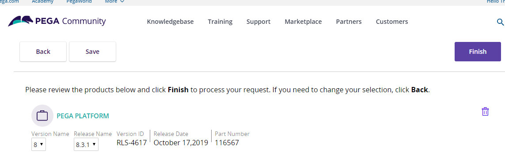
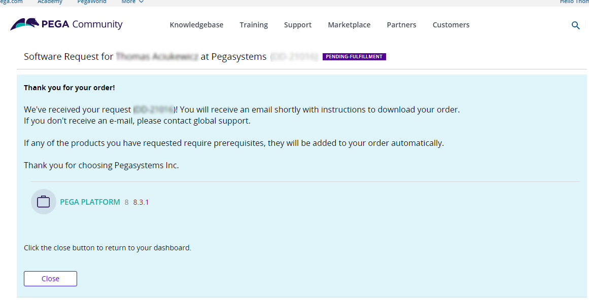

Building a Pega Platform installer docker image
-----------------------------------------------

These instructions require the Pega Platform distribution image to install the Pega Platform onto your database.

Clients with appropriate licenses can download a distribution image from Pega. For additional instructions, see [Pega Digital Software Delivery User Guide](https://community.pega.com/knowledgebase/documents/pega-digital-software-delivery-user-guide).

## Downloading a Pega Platform distribution to your local system

These instructions require the Pega Platform distribution image to install the Pega Platform onto your database. To obtain a copy, you must download an image from Pega. For detailed instructions, see [Pega Digital Software Delivery User Guide](https://community.pega.com/knowledgebase/documents/pega-digital-software-delivery-user-guide).

### Requesting access to a Pega Platform distribution

1. In the browser of your choice, navigate to the Pega [Digital Software Delivery](https://community.pega.com/digital-delivery) site.

2. Log into the [Pega Community](https://community.pega.com/knowledgebase/articles/pega-cloud/pega-cloud-services-patch-process-releases-83x-and-later)
    site with the credentials your Pega representative provided.

3. In the **Download and Upgrade Licensed Software** area, click **New
    request**.

4. In the right side of the page click **Continue**.

If you have multiple associations with the Pega Community, the page requests you to select the organization with which you want to affiliate this request and then click **Continue**. You will receive an email with a link to your software using an email address that is associated with the organization you select on this screen.

5. In the **You're viewing products available** page, enter **Pega Platform** in the **Search**, which will filter the list of products in the page.

The **Pega Platform** card should appear near the top of the card list, below
the list of all of the **Language packs for Pega Platform.**

6. In the Pega Platform card, your mouse arrow changes into a shopping cart icon, which you use to select **Pega Platform**.

The icon changes to a green check and a new cart item appears in the top right of the product list.


7. Click **Continue**.

8. In the cart review page, in the **Pega Platform** area, select the version
    of Pega Platform for your deployment.



9. After your selection and review are complete, click **Finish.**

10. When the order is processed, a confirmation screen displays with details about your order.

- An email with a link to the requested Pega Platform software is sent within a few minutes. The email address used is associated with the organization you selected in this section.



11. When satisfied with the order, click **Close**.

### Downloading Pega Platform to your local system

To download your Pega Platform image,

1. Open the email you received. It will look similar to the image shown.


2. Click **Download now**.

3. The **Pega Licensed Software Downloads** page opens.

You can download your requested Pega Platform software using the link under **My Downloads**.

4. Click **Download software**.

Your secure **Inbox** of requested Pega software products opens. Your request for a version of Pega Platform software is listed at the top of the inbox table.

5. In the **Subject** column, click the link to your requested Pega Platform software.

The Package details window opens in the Package tab, which shows details about the Pega Platform software distribution package that you requested.

6. In the **Files:** area of the window, ensure that version of the Pega distribution image is correct.

If it is not the right version number, you must complete a new request.

7. To download the file, select the Pega distribution image checkbox and click
    **Download**.

8. In the **Save as** window, choose the \<local filepath\>/\<platform\>-demo folder to which you save the Pega Platform distribution zip file.

9. In a Linux bash shell, change folders to the /home/\<local filepath\>/\<platform\>-demo directory, where you saved the Pega Platform distribution zip and extract your files to create a new distribution image folder on your local system:

    `$ unzip ./<pega-distribution-image>.zip`

After you extract the archive, the files in the Pega Platform distribution image are available to use in preparing your Pega Platform installation Docker image.

### Prepare your Pega Platform installation Docker image – 15 minutes

As stated previously, you must have a [DockerHub](https://hub.docker.com/) account and log into it in order to see the [pega-installer-ready Docker image](https://hub.docker.com/r/pegasystems/pega-installer-ready). You also need the Docker cli and Docker-desktop installed on your system before you begin this procedure. The Pega-provided Docker image, pega-installer-ready, includes some components of a full installation image that you can use to install or upgrade the Pega Platform database. While it is built on top of a JDK, it does not contain the contents of the Pega distribution kit which are essential for installing or upgrading Pega Platform.

Pega provides this image as the primary content of the final Docker image you will use to install or upgrade Pega Platform. This section describes how you can use this Docker image in combination with a Dockerfile and the Pega Platform distribution image that you have made available on your local system. The procedure assumes you’ve downloaded the software in [Downloading Pega Platform to your local system](#downloading-pega-platform-to-your-local-system) and installed the required Docker components on your local system.

Follow these steps to create a Docker image you can use to install or upgrade Pega Platform.

1. From a Linux bash shell, ensure you are logged into your DockerHub account:

    `$ docker login -u <username> -p <username-password>`

    For details about logging into Docker from a secure password file using the `--password-stdin` option, see <https://docs.docker.com/engine/reference/commandline/login/>.

2. Change your directory to the top folder of your Pega distribution <pega-distribution-image\>.

    `$ cd ./<pega-distribution-image>/`

3. Create a text file with the text editor of your choice in the \<local filepath\>/\<platform\>-demo/\<pega-distribution-image\> folder where you extracted the Pega distribution on your local system.

    From this folder, you can list the folder content and see folders for Pega archives, Images, rules, and scripts.

4. Copy the following lines of instruction into the new text file:

```yaml
FROM pegasystems/pega-installer-ready
COPY --chown=pegauser:root scripts /opt/pega/kit/scripts
COPY --chown=pegauser:root archives /opt/pega/kit/archives
COPY --chown=pegauser:root rules /opt/pega/kit/rules

```

These instructions direct a docker build function to use the Pega public Docker image, pega-install-ready, and these three folders from the Pega distribution image in order to build your Pega Platform installation image.

5. Save the text-only file with the filename, "dockerfile", without an extension, in the \<local filepath\>/\<platform\>-demo/\<pega-distribution-image\> folder where you extracted the Pega distribution on your local system.

6. From your Linux command prompt, in your current directory, build your pega install Docker image by entering:

    `$ docker build -t pega-installer .`

This command uses your dockerfile to build a full Docker image with the name “pega-installer” and gives it the tag, “latest”. You can use the Docker command to see that your new image exists in your Docker image inventory.

7. Tag the local version of your new image, pega-installer, with your DockerHub ID:

    `$ docker tag pega-installer <your-dockerhub-ID>/pega-installer`

8. Create a private repository on your [DockerHub](https://hub.docker.com/) account that is tagged as a private repository.

9. From your default login page, click the Repositories link (at the top of the page).

10. In the Repositories view, click **Create Repository +**.

11. Enter a Name that matches the Docker image you just built.

12. Provide a brief Description, that will help you remember the version of Pega
    with which you built this image, or any other useful information.

13. In the Visibility area, select the **Private**.

You should not maintain this image with Pega proprietary software as a viewable **Public** image.

14. Click **Create**.

Free DockerHub accounts support the use of a single private repository, so you may have to delete an existing private repository in order to create a new one for your Pega Docker installation image.

15. From a Linux bash shell, use the Docker command to push the new image to
    your new private repository:

    `$ docker push <your-dockerhub-ID>/pega-installer`

After the command completes you will see your new image in your private repository, similar to the image below.


