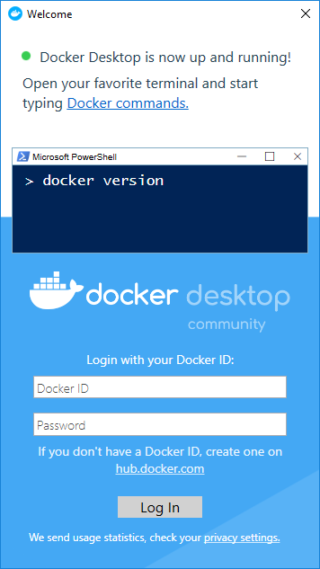
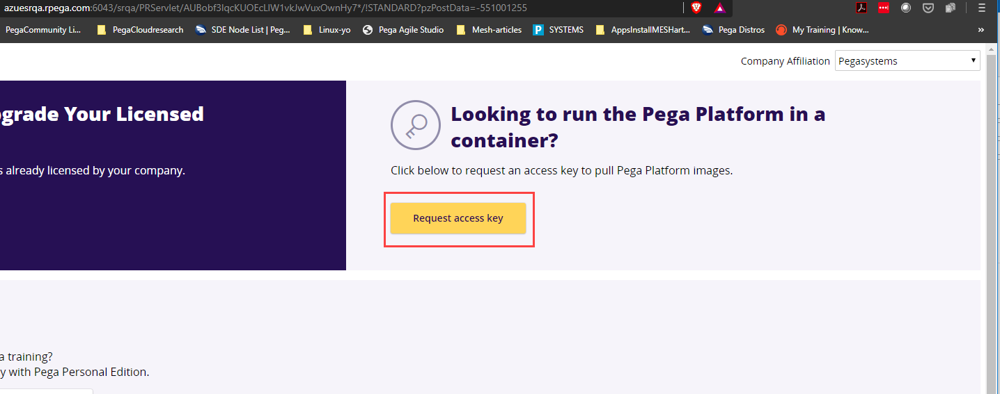
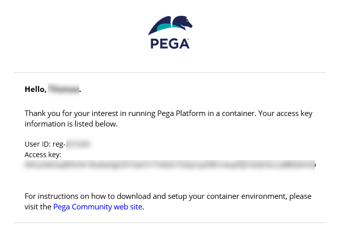

Preparing your local Windows 10 system – 45 minutes
==========================================================================

To deploy Pega Platform using a local Windows 10 system on which you can run commands with administrator privileges, prepare your system with required applications and configuration files that you need for your deployment. By preparing your system, you can complete the deployment without having to pause to install a Windows application or prepare a configuration file.

Before you begin
----------------

To prepare a Wndows 10 system, it is assumed:

- You have a basic familiarity with running commands from a Windows 10 PowerShell with administrator privileges.

- You have appropriate administrative privileges to install programs on your local computer.

- You use the open source packaging tool Chocolatey to install applications onto your Windows laptop. For more information, see [How Chocolatey Works](https://chocolatey.org/how-chocolatey-works).

- You have basic familiarity with a GitHub account with which you download a Pega-managed GitHub repository that contains configuration files and scripts that support installing Pega Platform and deploying it in the Kubernetes cluster.

Creating a local folder to access all of the configuration files
----------------------------------------------------------------

Deploying with Helm requires you to run commands from a specific folder on your local system. To ensure you use the correct filepath, these instructions always use the reference `<local filepath>\<platform>-demo` folder when you extract files to a folder or run commands from a folder.

To stay consistent with the instructions, you can create a folder named `<platform>-demo` on your local system at the top level of your Windows user folder. This way, you associate the generic `<local filepath>\<platform>-demo` references to the folder `C:\\Users\\\<your username\>\\\<platform\>-demo` that is specific to your local system.

To create this folder, open a Windows PowerShell command prompt with administrator privileges and enter:

    `$ mkdir C:\Users\<Windows-username><platform>-demo`

Where `<platform>-demo` is:

- For the AKS runbook, `AKS-demo`

- For the EKS runbook, `EKS-demo`

- For the TKGI runbook, `TKGI-demo`

- For the Openshift runbook, `Openshift-demo`

Currently there is no runbook for running on the Google Kubernetes Engine (GKE) using the Windows 10 Google SDK. To set up a system for a deployment on GKE, see [Prepare a local Linux system – 45 minutes](prepping-local-system-runbook-linux.md). 

You are ready to continue preparing your local system.

Installing required applications for the deployment
---------------------------------------------------

The entire deployment requires the following applications to be used during the configuration process; therefore, you should prepare your local system with all of the applications before you start your deployment:
- Helm (installed using Chocolatey, a Windows package manager application, or your preferred equivalent.)
- kubectl (installed using Chocolatey, a Windows package manager application, or your preferred equivalent.)
- Docker (install using Docker for windows)
- unzip (or an equivalent to extract files from .zip archive files.)
- az cli (only for AKS deployments)
- AWS IAM Authenticator for Kubernetes (only for EKS deployments)
- eksctl (only for EKS deployments)
- pks cli (only for TKGI deployments)

Some of the required applications are binary files that you download from the organization's download area; you can install other applications by using a Windows package manager application such as [Chocolatey](https://chocolatey.org/).

To install Chocolatey for the first time on your local system, follow these steps which are sourced from the [Install Chocolatey](https://chocolatey.org/install) page. Skip steps 1 - 3 if you already have it installed.

1. Open a Windows PowerShell command prompt with administrator privileges.

2. To ensure your PowerShell commands run without restrictions, enter:

    `$ Get-ExecutionPolicy`

3. To install Chocolatey and allow the use the use of appropriate security scripts it uses during installation of applications, enter:

    `$ Set-ExecutionPolicy Bypass -Scope Process -Force; iex ((New-ObjectSystem.Net.WebClient).DownloadString('https://chocolatey.org/install.ps1'))`

    The command returns messaging describing useful details and indicating a successful installation. You are ready to use Chocolatey to install each required application.

### Installing Helm and the kubernetes CLI commands:

Pega supports using Helm version 2.1 and later and the Kubernetes Command Line Interface (CLI) 1.15 and later. The latest runbooks use Helm version 3.0 and
kubernetes-cli 1.17.0. It is recommended to use these versions. If you use Helm 2.x, some of the commands differ slightly for Helm 2.x.

The default Helm version available in Chocolatey is 3.0.x; the version of kubernetes-cli used in the runbooks is version 1.17.x.

Enter the choco install command listed for each application into your PowerShell command prompt as shown:

- To install [Helm](https://chocolatey.org/packages/kubernetes-helm): in the PowerShell command prompt, enter:

    `$ choco install kubernetes-helm`

If a prompt to run the script appears, enter **Yes**.

For additional information, see [Helm documentation](https://helm.sh/docs/).

- To install [Kubernetes Command Line Interface](https://chocolatey.org/packages/kubernetes-cli): in the PowerShell command prompt, enter:

    `$ choco install kubernetes-cli`

If a prompt to run the script appears, enter **Yes**. 

The kubernetes-cli application includes the `kubectl` command.

For details about installing on Windows 10 and supported installation methods, see [Install kubectl on Windows](https://kubernetes.io/docs/tasks/tools/install-kubectl/#install-kubectl-on-windows).

For Amazon EKS only: Pega recommends deploying your EKS cluster for your Pega Platform deployment using the AWS `eksctl` command line utility for creating and managing clusters on Amazon EKS.

To install [eksctl](https://chocolatey.org/packages/eksctl): in the PowerShell command prompt, enter:

`$ choco install eksctl`

If a prompt to run the script appears, enter **Yes**.

PS C:\Users\aciut> eksctl version
[ℹ]  version.Info{BuiltAt:"", GitCommit:"", GitTag:"0.13.0"}

For Amazon EKS only: Pega recommends using the AWS IAM Authenticator for Kubernetes to authenticate with your Kubernetes cluster using your AWS credentials.

To install [AWS IAM Authenticator for Kubernetes](https://chocolatey.org/packages/aws-iam-authenticator#files): in the PowerShell command prompt, enter:

`$ choco install aws-iam-authenticator`

If a prompt to run the script appears, enter **Yes**. 

Confirm the AWS CLI that comes withe the `AWS IAM Authenticator for Kubernetes` installation.

```yaml
$ aws --version
aws-cli/1.16.272 Python/3.6.0 Windows/10 botocore/1.13.8
```

### For AKS only: installing the Azure CLI

To install the Azure CLI using a Windows PowerShell command prompt with administrator privileges, enter:

`$ Invoke-WebRequest -Uri https://aka.ms/installazurecliwindows -OutFile .\\AzureCLI.msi; Start-Process msiexec.exe -Wait -ArgumentList '/I AzureCLI.msi /quiet'`

The prompt returns when the installation is completed.

For details about installing the Azure CLI on a Windows system, see [Install Azure CLI on Windows](https://docs.microsoft.com/en-us/cli/azure/install-azure-cli-windows?view=azure-cli-latest).

### For TKGI only: installing pks cli

Install the PKS CLI binary executable file from the VMware Enterprise PKS support site that you run with Windows administrator permissions during the TKGI deployment steps:

1. Use the browser of your choice to navigate to [Installing the PKS CLI](https://docs.pivotal.io/pks/1-7/installing-pks-cli.html) and log in.

2. Open the latest version and navigate to the Windows section.

3. Click **PKS CLI – <version>**.

4. Click **PKS CLI - Windows**.

5. In the EULA tab, click **AGREE**.

6. In the Windows explorer window, choose the `TKGI-demo` folder to save the `pks-windows-amd64-1.5.1-build.xx.exe` file, change the filename to `pks.exe`, and then click **Save**.

7. Add this executable file to the PATH on your local computer so you can run `pks` from the command-line by entering:

    `$env:path += ";C:\Users\<Windows-username>\<platform>-demo"`

    Advanced users can add the binary file to their path using their preferred method. These instructions were mostly sourced from the [Installing the PKS CLI](https://docs.pivotal.io/pks/1-7/installing-pks-cli.html).

### Installing Docker Desktop on Windows 10

In order to build a docker installation image in the section, [Deploying Pega Platform using Pega-provided docker images](#Deploying-Pega-Platform-using-Pega-provided-docker-images), you must install the Community Edition (CE) of Docker for Windows. To do so, you must download, install, and log into Docker for Windows in order to complete the setup on your local system. For your convenience, the instructions available on the Docker website are included in this this section of this document.
Deploying Pega Platform using Pega-provided docker images

1. Download the installer (Docker for Windows Installer.exe) from [download.docker.com](https://download.docker.com/win/stable/Docker%20for%20Windows%20Installer.exe).

Locate the executable file that downloads to your local system.

2. Run the Docker for Windows Installer.exe installer using administrator privileges.

3. Follow the install wizard to accept the license, authorize the installer to
    make changes on your computer, and proceed with the install.

As part of the initial installation, you must authorize Docker.app with your system password during the install process. The Docker application requires access to enable Hyper-V and containers, install networking components, and links to the Docker apps. The installation requires several reboots to install/enable these features. Docker Desktop takes 1-3 minutes to display on initial start.

4. In the **Configuration** window, do not select **Use Windows containers
    instead of Linux containers (this can be changed after the installation)**
    and click **OK**.

5. Click **Close**.

6. To complete your Docker Desktop setup, in the windows search bar, enter
    “docker” in the search field and select the Docker Desktop app in the search
    results.


7. Log into the Docker Desktop application when you are prompted, using your
    DockerHub credentials.



After you log in, the docker CLI is available from a Windows PowerShell command
prompt. These instructions were mostly sourced from the article,
<https://docs.docker.com/v17.09/docker-for-windows/install/>.

Creating SSL certificates for HTTPS load balancer on a Kubernetes ingress
-----------------------------------

When you configure an HTTPS load balancer through a Kubernetes ingress, you can configure the load balancer to present authentication certificates to the client. After you generate your certificates and corresponding private keys using any SSL Certificate creation tool, you pass the certificates and private keys to your Kubernetes ingress using the method supported for the specific environment. For Pega support details, see the [Addons Helm chart](https://github.com/pegasystems/pega-helm-charts/tree/master/charts/addons). 

Use the generation method best suited to your company standards. The following steps create one or more certificates and private keys for a host name using a manually verified domain.

1. Navigate to the certificate generator, such as [SSL For Free](https://www.sslforfree.com/).

2. Enter your host name for which you are creating a certificate and click **Create FreeSSL Certificate**.

3. To validate the certificate manually, click **Manual Verification (DNS)**.

   The **Manually Verify Domain (DNS)** option displays.

4. Click **Manually Verify Domain**.

   The **Update DNS Records** screen displays a name/host record, an associated verification value.

5. Using the DNS lookup management system of your choice, associate the generated name/host record with the verification value. For instance:

```java
Name          :   _acme-challenge.demotest.dev.pega.io
Type          :   TXT
TTL (Seconds) :   1
Value         :  "ezEiD0Lkvvzlgfaqdohe3ZcX7s4vVF6hHlBBKI3sL38"
```

With the host name associated with the verification value, wait several minutes to ensure the configuration is established.

6. Click the link for name/host record.

   A new page displays the status of the connection.

7. When successful, you will see that the link returned the correct value and you can generate the SSL certificate files.

   If it is not successful, you may have to wait longer for the DNS lookup to correctly associate the verification value with the host name; if it continues to not work, you may need to update your DNS settings.

8. In the main page of **SSL for Free**, click **Download All SSL Certificate Files** and save the certificate file and private key file in the \<platform\>-demo folder you have already created on your local system.

You will manage these certificates in the environment to which you deploy Pega Platform. For environment-specific details, see the **Deploying Pega Platform using the command line** section in the runbook for that environment

Deploying Pega Platform using Pega-provided docker images
---------------------------------------------------------

To deploy Pega Platform, you must pull several required images from the Pega-managed Docker image repository and push them into your private Docker registry from where you reference them in the Pega Helm chart. For more information, see [Pega Helm chart](https://github.com/pegasystems/pega-helm-charts).

Pegasystems uses a standard naming practice of hostname/product/image:tag. Pega images are available from the host site, pega-docker.downloads.pega.com. Pega maintains three types of required Docker images for Client-managed Cloud deployments of Pega Platform:

 Name        | Description                                           | Tags     |
-------------|-------------------------------------------------------|----------|
`platform/installer`   | A utility image with which you install all of the Pega-specific rules and database tables in the “Pega” database that you have configured for your deployment. This installation is required before a deployment can take place.| `<version>` |
`platform/pega`  | (Download required) Deploys Pega Platform with its customized version of the Tomcat application server.| `<version>` or `<version>-YYYYMMDD` |
`platform/search` | (Download required) Deploys the required search engine for Pega Platform search and reporting capabilities. This Docker image contains Elasticsearch and includes all required plugins.| `<version>` or `<version>-YYYYMMDD` |

When you decide on a Pega Platform version for your downloaded Docker images, you should use the same version tag for each of the three images you download.

For the `platform/installer` image, the :tag represents the version of Pega you want to install, for example the tag :8.5.1 will install Pega Platform version 8.5.1.

For `platform/pega` and `platform/search` images, Pega also offers an image with a version tag appended with a datestamp using the pattern `pegaVersion-YYYYMMDD` to indicate the version and the date that Pega built the image. For example, if you pull the `platform/pega` with a tag, `pega:8.5.1-20201026`, the tag indicates that Pega built this 8.5.1 image on 26 October 2020. Using the version tag without the datestamp will always point to the most recently built image for that version.

The datestamp ensures that the image you download includes the changes that Pega engineering commits to the repository using pull requests by a certain date. While Pega builds the most current patch version of each minor release one time each day, Pega makes the last five daily-built images available for client downloads.  After Pega releases a new patch version, the prior patch version no longer receives daily builds with a datestamp tag.

After you obtain access to the Pega-provided host repository and pull each image, you can re-tag and push each of the three Pega-provided images to your preferred Docker registry to make them available to the deployment as described in the next section. You then provide your registry URL, credentials, and reference each image appropriately in the Pega Helm chart. You can find example usage details for referencing the three images in a repository in the appropriate runbook for your type of deployment.

These images do not expire, and you can keep them in your repository for as long as you require.

Pega also supports experienced client's ability to build your own installer docker image using components of a full Pega Platform 8.3 or later distribution image to install or upgrade the Pega Platform database. If you build your own installation image, you do not have to download the Pega-provided docker image listed in the table. For details on building your own image, see [Building a Pega Platform installer docker image](building-your-own-Pega-installer-image.md).

## Downloading a Pega Platform installer docker image

Clients with appropriate licenses can log in to the image repository and download docker images that are required to install the Pega Platform onto your database.

### Requesting access to the Pega Docker repository

1. In the browser of your choice, navigate to the Pega [Digital Software Delivery](https://community.pega.com/digital-delivery) site.

2. Log into the [Pega Community](https://community.pega.com/knowledgebase/articles/pega-cloud/pega-cloud-services-patch-process-releases-83x-and-later)
    site with the credentials your Pega representative provided.

3. In the **Download and Upgrade Licensed Software** area, click **New
    request**.

4. In the right side of the page, click **Request access key**.



5. Enter your credential details.

   After you enter valid credentials, you recieve confirmation that an email is on the way. 


6. Open the email you received. It will look similar to the image shown.



7. Save your access key to a text file the <local filepath>\<platform>-demo folder so you can pass it into your docker login command to ensure the it will not display in your bash history or logs.

### Downloading and managing Pega Platform docker images

With access credentials to the Pega Docker image repository, you log in, download each required image, retag each image appropriately, and finally upload each image to your own Docker registry. For an overview of tagging and managing Docker images, see the Docker article, [Deploy a registry server](https://docs.docker.com/registry/deploying/).

Important: Use the same Docker image tag to ensure you download compatible images.

Pega supports any of the following Docker image registries from which your deployment will access the three Pega-provided Docker images. For details about setting up your choice of Docker registry, click the link for that registry's documentation:

- [DockerHub](https://docs.docker.com/docker-hub/repos/)
- [Amazon elstic Container Registry (ECR)](https://docs.aws.amazon.com/AmazonECR/latest/userguide/get-set-up-for-amazon-ecr.html)
- [Azure Container Registry](https://azure.microsoft.com/en-us/services/container-registry/)
- [Google Cloud Container Registry](https://cloud.google.com/container-registry/)

With a Docker registry configured, clients push their three Pega-provided images to their registry so it is available to the deployment. Clients must also provide their registry URL, credentials, and then reference each image appropriately in the Pega Helm chart.

Examples:

```yaml
# If using a custom Docker registry, supply the credentials here to pull Docker images.
  docker:
    registry:
      url: "YOUR_DOCKER_REGISTRY"
      username: "YOUR_DOCKER_REGISTRY_USERNAME"
      password: "YOUR_DOCKER_REGISTRY_PASSWORD"
      # Docker image information for the Pega docker image, containing the application server.
    pega:
      image: "<Registry host name:Port>/my-pega:<Pega Platform version>"

# Elasticsearch deployment settings.
pegasearch:
  image: "<Registry host name:Port>/my-pega-search:<Pega Platform version>"
  memLimit: "3Gi"
  replicas: 1

# Pega Installer settings.
installer:
  image: "<Registry host name:Port>/my-pega-installer:<Pega Platform version>"
  adminPassword: "ADMIN_PASSWORD"
```

Example usage details for referencing your three images in a repository are included in the appropriate runbook for your type of deployment.

It is a best practice to retag each of your Pega Docker images by including your registry host name and port; if this information is not included, the docker tag command uses the Docker public registry located at [registry-1.docker.io](https://registry-1.docker.io/) by default. For more details and naming convention guidance, see the [docker tag](https://docs.docker.com/engine/reference/commandline/tag/) documentation.

1. In Windows PowerShell running with administrator privileges, navigate to the <localfilepath>\<platform>-demo folder where you saved the file that contains your access key and log into the Pega-managed Docker image repository:

```bash
$ cat <localfilepath>\<platform>-demo\<access-key-filename>.txt |  docker login pega-docker.downloads.pega.com --username=<reg-XXXXX> --password-stdin
Login Succeeded
```
2. To download your preferred version of the `Pega` image to your local system, specify the version tag when you enter:

```bash
$ docker pull pega-docker.downloads.pega.com/platform/pega:<version>
Digest: <encryption verification>
Status: Downloaded pega-docker.downloads.pega.com/platform/pega:<version>
```

3. Retag the `Pega` image for your deployment with a customized tag that includes your Docker registry host name and a name that is useful to your organization, such as `<Registry host name:Port>/my-pega:<Pega Platform version>`.

   `$ docker tag pega-docker.downloads.pega.com/platform/pega:8.4.0 <Registry host name:Port>/my-pega:8.4.0`

4. To push the retagged `my-pega` image to your registry, enter:

   `$ docker push <Registry host name:Port>/my-pega:8.4.0`

5. To download your preferred version of the `search` image to your local system, specify the version tag when you enter:
 
```bash
$ docker pull pega-docker.downloads.pega.com/platform/search:<version>
Digest: <encryption verification>
Status: Downloaded pega-docker.downloads.pega.com/platform/search:<version>
```

6. To retag the `search` image for your deployment with a customized tag that includes your Docker registry host name and a name that is useful to your organization, such as `<Registry host name:Port>/my-pega-search:<Pega Platform version>`, enter:

   `$ docker tag pega-docker.downloads.pega.com/platform/search:8.4.0 <Registry host name:Port>/my-pega-search:8.4.0`

7. To push the retagged `my-pega-search` image to your registry, enter:

   `$ docker push <Registry host name:Port>/my-pega-search:8.4.0`

8. To download your preferred version of the `installer` image to your local system, specify the version tag when you enter:

```bash
$ docker pull pega-docker.downloads.pega.com/platform/installer:<version>
Digest: <encryption verification>
Status: Downloaded pega-docker.downloads.pega.com/platform/installer:<version>
```

9. To retag the `installer` image for your deployment with a customized tag that includes your Docker registry host name and a name that is useful to your organization, such as `<Registry host name:Port>/my-pega-installer:<Pega Platform version>`, enter:

   `$ docker tag pega-docker.downloads.pega.com/platform/installer:8.4.0 <Registry host name:Port>/my-pega-installer:8.4.0`

10. To push the retagged `my-pega-installer` image to your registry, enter:

   `$ docker push <Registry host name:Port>/my-pega-installer:8.4.0`

After you push these three downloaded images to your private Docker registry, you are ready to begin deploying Pega Platform to a support Kubernetes environment. Use the runbook in this Github directory for your deployment.
