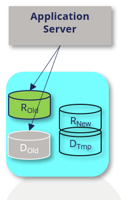
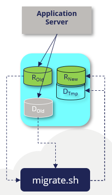
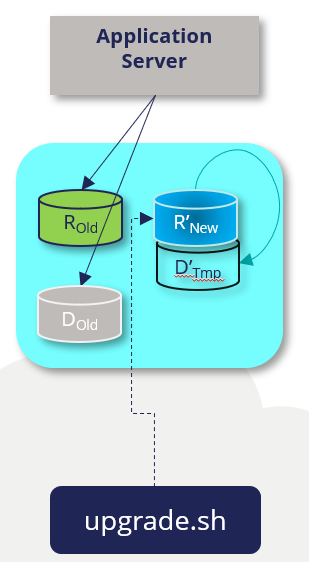

# Upgrading Pega Platform in your deployment with zero-downtime

After you deploy Pega Platform™ on your kubernetes environment, you can use a Pega-provided Docker image-based process to upgrade your Pega software with zero-downtime. The following procedures are written for any level of user, from a system administrator to a development engineer who wants to use helm charts and Pega Docker images to upgrade the Pega software you have deployed in any supported kubernetes environment.

For the latest Pega Community articles about Pega-provided docker images, see [About client managed cloud](https://community.pega.com/knowledgebase/articles/client-managed-cloud/86/about-client-managed-cloud).

## Kubernetes-based zero-downtime upgrade process overview

Pega Infinity™ upgrades starting from version 8.4.2 feature a near-zero-downtime process, so your environment remains available you can continue working in your application during the upgrade. You complete a zero-downtime upgrade using Pega helm charts, which automate the Pega zero-downtime upgrade process using the four schemas used in the version 8.4 and later Pega patch and upgrade processes:

- Data schema – your existing data schema. This will be your data schema after the zero-downtime upgrade.
- Rules schema – your existing rules schema. This schema is upgraded during the zero-downtime upgrade.
- A temporary data schema (Dtmp) – a schema the process creates on the same database to host some required data-specific tables. You specify the name before the upgrade process and you must discard this schema after the upgrade.
- New rules schema (Rn) – a rules schema the process creates on the same database for staging the rules during the upgrade. This schema will become the rules schema after the upgrade.

Before beginning your upgrade, you must create empty schemas - the new rules schema and new temporary data schema  - in your existing database as shown in the image below.

   

The Pega zero-downtime upgrade process for Client-managed cloud automates the Pega zero-downtime upgrade scripts that copy and replace application rules and that copy data between these schemas appropriately. The process automates the following order of tasks, so clients only have to use the `helm upgrade release --namespace mypega` command as directed in the deployment section - [Upgrading your Pega Platform deployment using the command line](#upgrading-your-pega-platform-deployment-using-the-command-line):

1. Configures the high availability cluster settings, including disabling rule creation, so you and your customers can continue making rule changes while the upgrade processes run.

2. Creates the target schemas and migrates the rules structure and content and data structure from the existing rules and data schemas to the new rules and temporary data schemas.

   

3. Runs the migration script, which creates any required tables in the new rules and temporary data schemas, and copies and moves the rule content.

   

4. Upgrades the new rules schema. This process uses the temporary data schema in which it creates and modifies any necessary data tables to store interim data content.

5. For deployments running in Oracle, grants access to the new rules schema tables to generate the necessary rules objects (GRANT statements) which will link the existing data schema to the new rules schema after you upgrade the new rules schema.

6. Upgrades the existing data schema.

7. Redeploys the application to run using the new rules and then performs a rolling restart of your deployment cluster.

8. Reverts the high availability cluster settings to re-enable rule creation so your development team can create and extend rule creation.  

Pega software upgrades do not touch the infrastructure of your Kubernetes environment.

## Client-required steps

Client-managed cloud clients use the Pega Kubernetes tools and Helm charts in the same Pega repository that you used to install Pega Platform in a supported Kubernetes environment. To complete an upgrade using these tools, you must perform the following tasks:

1. Prepare your Docker repository by downloading the latest Pega-provided release images (platform/installer, platform/pega, and either platform/search or platform-services/search-n-reporting-service) in your release stream and pushing them into your preferred Docker image repository. For step-by-step details, see [Downloading and managing Pega Platform docker images (linux)](prepping-local-system-runbook-linux.md#downloading-and-managing-pega-platform-docker-images) or [Downloading and managing Pega Platform docker images (windows)](prepping-local-system-runbook-windows.md#downloading-and-managing-pega-platform-docker-images).

2. Edit the pega Helm chart as directed in [Upgrading Pega Platform with zero-downtime using Helm charts – 120 minutes](#upgrading-pega-platform-with-zero-downtime-using-helm-charts--120-minutes).

3. Invoke the upgrade process by using the `helm upgrade release --namespace mypega` command as directed in the deployment section - [Upgrading your Pega Platform deployment using the command line](#upgrading-your-pega-platform-deployment-using-the-command-line).

4. Delete the temporary data schema from your database after you complete your upgrade.

Upgrading Pega Platform with zero-downtime using Helm charts – 120 minutes

## Assumptions and prerequisites

The process to upgrade your deployment with zero-downtime assumes:

- Your deployment is running Pega Platform 8.4.2 or later.

- You use the Pega-provided Helm charts that support ZDT upgrades (version 1.6.0 and later).

- To update your software to version 8.8 or later, please review the infrastructure requirements to use an externalized Kafka streaming service managed using Pega-provided Helm charts. Before you complete a software update, Pega recommends that you migrate the deployment infrastructure from using embedded stream nodes to one that uses an externalized Kafka configuration. For details, see [Kafka cluster requirements](../charts/pega/KafkaClusterRequirement.md) and [Switch from embedded Stream to externalized Kafka service](../charts/pega/MigrationToExternalStream.md).

## Upgrading Pega Platform with zero-downtime using Helm charts – 120 minutes

To keep your system current using the zero-downtime upgrade process by using Helm charts, you must customize your existing `pega` Helm chart with the specific, required or settings. This includes referencing the latest Pega-provided Docker images that are available for your release.

The Pega zero-downtime upgrade process takes about 180 minutes total, but varies, depending on your deployment details.

### Updating the Pega configuration files to your Helm installation on your local system

To complete an upgrade using the charts in the Pega-provided repository of Helm charts you must update the repository so you use chart version 1.6.0 and later.

1. To update the Pega repository to your Helm installation, enter:

    `$ helm repo update pega https://pegasystems.github.io/pega-helm-charts`

2. To verify that you have the new repository, you can search it by entering:

```
  $ helm search repo pega
  NAME                  CHART VERSION   APP VERSION     DESCRIPTION
  pega/pega             1.6.0                           Helm chart to configure required installation and deployment configuration settings in your environment for your deployment.
  pega/addons           1.6.0           1.0             Helm chart to configure supporting services and tools in your environment for your deployment.
  pega/backingservices  1.6.0                           Helm Chart to provision the latest Search and Reporting Service (SRS) for your Pega Infinity deployment
```

#### Updating the pega.yaml Helm chart values

To configure the parameters in the pega.yaml Helm, download the file in the charts/pega folder, edit it with a text editor, and then save it to your local system using the same filename.

To complete an upgrade with zero downtime,  configure the following settings in your pega.yaml:

- Specify `action.execute: upgrade` to upgrade your application using the software version contained in your Pega-provided "installer" image.
- Specify the source schema names in your database:
  - `jdbc.rulesSchema: "YOUR_RULES_SCHEMA"`
  - `jdbc.dataSchema: "YOUR_DATA_SCHEMA"`
- For existing AKS and PKS deployments, provide reference details for the service host and https service port of the Kubernetes API server (this is not required for installations). For example, the Kubernetes master is running at `https://<service_host>:<https_service_port>` complete these values:
  - `upgrade.kube-apiserver.serviceHost: "https://<service_host>"`
  - `upgrade.kube-apiserver.httpsServicePort: "<https_service_port>"`
  - For EKS and GKE deployments, leave the existing parameter text values (do not leave them blank).

- Update the tagging details to reflect the version and date of your latest Pega-provided Docker images available in your repository for your upgrade:

  - The Pega-provided `docker.image: "YOUR_PEGA_IMAGE:TAG"`
  - The Pega-provided `pegasearch.image: "YOUR_SEARCH_IMAGE:TAG"`
  - The Pega-provided `installer.image: "YOUR_INSTALLER_IMAGE:TAG"`

- In the installer section of the Helm chart, update the following:

  - Specify `installer.upgradeType: "Zero-downtime"` to use the zero-downtime upgrade process.
  - Specify `installer.targetRulesSchema: "<target-rules-schema-name>"` and `installer.targetDataSchema: "<target-data-schema-name>"` for the new target and data schema name that the process creates in your existing database for the upgrade process.

You can leave the existing customized parameters as is; the upgrade process will use the remaining existing settings in your deployment.

1. To download the pega.yaml Helm chart to the updated \<local filepath>\<environment>-demo, enter:

`$ helm inspect values pega/pega > <local filepath>/<environment>-demo/pega.yaml`

2. Use a text editor to open the pega.yaml file and update the following parameters in the chart based on your Kubernetes environment requirements:

   | Chart parameter name    | Purpose                                   | Your setting |
   |-------------------------|-------------------------------------------|--------------|
   | actions.execute: | To upgrade using the zero-downtime upgrade process, specify an “upgrade-deploy” deployment type. | execute: "upgrade-deploy" |
   | jdbc.rulesSchema: "YOUR_RULES_SCHEMA"  | Specify the name of the existing rules schema from which the upgrade process migrates the existing rules structure to your new rules schema.  | rulesSchema: "YOUR_RULES_SCHEMA" |
   | jdbc.dataSchema: "YOUR_DATA_SCHEMA"  | Specify the name of the existing data schema to which the upgrade process migrates the existing data structure from the existing data schema  | dataSchema: "YOUR_DATA_SCHEMA"  |
   | Optional: jdbc.customerDataSchema: "YOUR_DATA_SCHEMA"  | Optionally specify the name of a data schema separate from case data that is for your business and customer data. The `customerDataSchema` parameter defaults to the value of `dataSchema` if you leave this set to default value. | customerDataSchema : "YOUR_DATA_SCHEMA"  |
   | docker.registry.url: username:  and password: | If using a new registry since you installed Pega Platform, update the host name of a registry to an object that contains the “username” and “password” values for that registry. For more information, search for “index.docker.io/v1” in [Engine API v1.24](https://docs.docker.com/engine/api/v1.24/). You can skip this section if the registry is the same as your initial installation. | <ul><li>url: “<https://index.docker.io/v1/>” </li><li>username: "\<DockerHub account username\>"</li><li> password: "\< DockerHub account password\>"</li></ul>    |
   | docker.pega.image:       | Update the tagging details, including the version and date of your latest Pega-provided `platform/pega` Docker image that you downloaded and pushed to your Docker registry. This image should match the version of the installer image with which you complete the upgrade. | Image: "\<Registry host name:Port\>/my-pega:\<Pega Platform version>" |
   | <ul><li>upgrade.kube-apiserver. serviceHost</li><li>upgrade.kube-apiserver.httpsServicePort</li></ul>  | For existing AKS and PKS deployments, for the service host and https service port of the Kubernetes API server. For EKS and GKE deployments, leave the existing text values (do not leave them blank).| <ul><li>upgrade.kube-apiserver.serviceHost: "API_SERVICE_ADDRESS" </li><li>upgrade.kube-apiserver.httpsServicePort: "SERVICE_PORT_HTTPS"</li></ul> |
   | pegasearch.image: | Update the tagging details, including the version and date of your latest Pega-provided `platform/pega` Docker image that you downloaded and pushed to your Docker registry. | Image: "\<Registry host name:Port>/my-pega-search:\<Pega Platform version>"
   | installer.image: | Update the tagging details, including the version and date of your latest Pega-provided `platform/installer` Docker image that you downloaded and pushed to your Docker registry. | Image: "\<Registry host name:Port>/my-pega-installer:\<Pega Platform version>" |
   | installer.adminPassword: | Specify an initial administrator@pega.com password for your installation.  This will need to be changed at first login. The adminPassword value cannot start with "@".| adminPassword: "\<initial password\>"  |
   | installer.upgrade.upgradeType   | Specify an zero-downtime upgrade to upgrade using the zero-downtime upgrade process. | upgradeType: "zero-downtime"  |
   | installer.upgrade.targetRulesSchema   | For upgrades from 8.4.2 and later, specify a new rules schema name within the quotes that the process uses to create the schema in your existing database to support the upgrade process.| targetRulesSchema: ""  |
   | installer.upgrade.targetDataSchema   | For upgrades from 8.4.2 and later, specify the new target data schema name within the quotes that the process uses to create the schema in your existing database to support the upgrade process. You must delete this schema from your database after you complete your upgrade. For upgrades starting at earlier versions, you can leave this value empty, as is (do not leave it blank). | targetDataSchema: "" |

2. Save the file.

### Upgrading your Pega Platform deployment using the command line

In this document, you specify that the Helm chart always “deploys” by using the setting, actions.execute: "upgrade-deploy argument". After you have your customizations saved in your pega Helm chart, you are ready to upgrade.

1. Do one of the following:

   - Open Windows PowerShell running as Administrator on your local system and change the location to the top folder of your `\<platform\>-demo` folder that you created in [Preparing your local Windows 10 system](https://github.com/pegasystems/pega-helm-charts/blob/master/docs/prepping-local-system-runbook-windows.md).

      `$ cd <local filepath>\<platform>-demo`

   - Open a Linux bash shell and change the location to the top folder of your `\<platform\>-demo` directory that you created in [Preparing your local Linux system](https://github.com/pegasystems/pega-helm-charts/blob/master/docs/prepping-local-system-runbook-linux.md).

      `$ cd /home/<local filepath>/<platform>-demo`

2. Upgrade Pega Platform using your updated `pega` Helm chart.

   ```yaml
   helm upgrade mypega-<platform>-demo pega/pega --namespace mypega-<platform>-demo --values pega.yaml
   ```

   A successful upgrade immediately returns details that shows progress for your `mypega-<platform>-demo` deployment.

3. Refresh the Kubernetes dashboard that you opened in the previous section. If you closed the dashboard, start the proxy server for the Kubernetes dashboard and then relaunch the web browser.

4. In the dashboard, in **Namespace** select the `mypega-<platform>-demo` view and then click on the **Pods** view. Initially, you can some pods have a red status, which means they are initializing:

    You can follow the progress of your upgrade using the dashboard. Initially, while the resources make requests to complete the configuration, you will see red warnings while the configuration is finishing, which is expected behavior.

5. To view the status of an installation, on the Kubernetes dashboard, select **Jobs**, locate the **pega-zdt-upgrade** job, and click the logs icon on the right side of that row.

   After you open the logs view, you can click the icon for automatic refresh to see current updates to the upgrade log.

6. To see the final deployment in the Kubernetes dashboard after about 15 minutes, refresh the `mypega-<platform>-demo` namespace pods.

   A successful deployment does not show errors across the various workloads. The `mypega-<platform>-demo` Namespace **Overview** view shows charts of the percentage of complete tiers and resources configurations. A successful deployment has 100% complete **Workloads**.

   It takes a little over an hour for the upgrade process to upgrade the applicable rules and then perform a rolling reboot of your nodes.